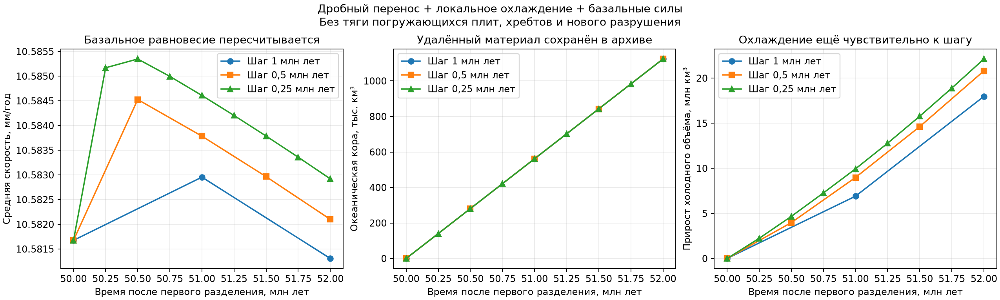

# Дробный материал: локальное охлаждение и базальная динамика

Следующий реализованный этап: [исправление времени рождения и охлаждения](FRACTIONAL_TIME_INTEGRATION_FIX.md).
Ниже сохранены результаты прежней схемы `endpoint_v1`; новый запуск по умолчанию
использует `gauss2_v2`. Для воспроизведения таблицы этого отчёта режим указан явно.

30.09.2026. Рабочая копия: `D:\Moon Project\mantle-convection`, ветка
`fix/genesis-mantle-convection`. Продолжение
[этапа дробного переноса](FRACTIONAL_TRANSPORT_IMPLEMENTATION.md).

Реализован работающий экспериментальный контур: движение переносит порции
материала, их собственный возраст определяет локальное охлаждение, а толщина
охлаждённого слоя влияет на передачу мантийной нагрузки и новые скорости.
Глобальные тепло и орбита продолжаются существующим Genesis.

**Это отдельный расчёт только с базальными силами.** Внутри него ещё нет тяги
погружающейся плиты, сил хребтов, нового разрушения и изменения топологии.
Основной расчёт и GUI остаются на механике 0.5. Их прежние файлы проверены
по контрольным суммам; этот этап их не изменяет.

## Что реализовано

[fractional_thermal.py](tectonics/fractional_thermal.py) применяет существующий
закон локального охлаждения механики 0.5 к каждой порции отдельно. Возрасты
соседних порций не усредняются. Сохраняются площадь, химический объём коры,
владелец, происхождение и поля повреждения. Изменения холодного объёма и
избыточной массы записываются как отдельный вклад охлаждения.
Температурная диффузивность наследуется из конфигурации исходного расчёта.

Для очень молодой поверхности холодный слой может лежать целиком внутри
химической коры. Поэтому решатель получает настоящую общую толщину холодного
слоя; сумма химической толщины коры и холодной мантии её не заменяет.

[fractional_dynamics.py](tectonics/fractional_dynamics.py) собирает моменты и
сопротивления по площади каждой порции и решает равновесие каждой плиты в СИ.
Даже доля плиты, занимающая меньшинство ячейки, участвует в её движении.
Используется прежний закон заданного источника и независимого сопротивления:

`τ = c(H) τ_source − β u_plate`, `c(H) = 1 − exp(−H/H_c)`.

Прежняя интерполяция коэффициента передачи с ячеек на вершины сохранена.
Для смешанной ячейки собственный вклад рассматриваемой порции определяется
её толщиной; соседние вклады используют средний **коэффициент передачи после
нелинейного преобразования**, а не среднюю толщину. Это явно заданное
приближение неизвестного расположения порций внутри ячейки. Оно точно
восстанавливает прежний закон для одной порции на ячейку, в том числе при
неоднородной толщине. Тесты проверяют и смешанный случай независимым
перебором чистых состояний, и неизменность при дроблении одинакового материала.

[fractional_coupling.py](tectonics/fractional_coupling.py) связывает компоненты:

1. Считает базальное равновесие в начале шага.
2. Переносит все порции с полученными скоростями.
3. Продолжает глобальные тепло и орбиту до того же момента времени.
4. Обновляет локальное охлаждение и рассчитывает скорости в конце шага.
5. Проверяет балансы и публикует только полностью допустимое состояние.

Это расщепление первого порядка. Удалённые порции сохраняют время и возраст
удаления, но холодные свойства начала транспортного шага. Их ещё нельзя
использовать как материал с точно рассчитанной температурой в момент
погружения для силы slab pull.

## Материал, тепло и сохранение

Площадь, объём коры, холодный объём и избыточная масса учитываются раздельно:

`остаток + удалённое − рождённое − вклад охлаждения = начальный запас`.

Для площади и химического объёма вклад охлаждения строго нулевой. Удалённые
порции вместе с происхождением, свойствами и долями принимающих плит остаются
в полном пассивном архиве. В мантию они автоматически не возвращаются.
Рождение коры списывает эквивалентную массу из конечного опорного запаса
мантии; исчерпание запаса прекращает шаг. При импорте состояния на 50 млн
лет используется оставшийся запас из этого сохранения.

Этот материальный счёт не становится дополнительным тепловым резервуаром.
Genesis продолжает собственную энергию, орбиту и воду; механический дефицит
температуры порций не вычитается из его энергии повторно. Это пассивное
температурное приближение, а не пространственный решатель мантийного тепла.

Единый `fractional_checkpoint.json` сохраняет порции, все тепловые переменные,
опорный столб, орбиту, полный архив удалённого материала, баланс и историю.
Продолжение проверяет формат, контрольную сумму, сетку, исходные файлы,
физические параметры, часы и соответствие архива потерям. Старое сохранение
эксперимента с фиксированной скоростью не принимается за связанное состояние.

## Проверенные результаты

**260 тестов прошли за 23,96 с.** Включены прежние тесты переноса, базальных
сил, локального охлаждения и совместимости погружения, а также новые проверки
порций и связанного расчёта. Полная карта —
[TEST_MAP.md](analysis/fractional_coupling_validation/TEST_MAP.md),
журнал — [final_tests.log](analysis/fractional_coupling_validation/final_tests.log).

Проведены шесть реальных запусков: молодой Starter на 0,5 млн лет; поверхность
из сохранения после 50 млн лет на следующие 2 млн лет с тремя шагами; и две
части того же расчёта для проверки сохранения и продолжения.

Для поверхности на 50 млн лет начальное базальное равновесие даёт среднюю
скорость 10,581676 мм/год. Следующие значения относятся только к этому
эксперименту с исключёнными силами хребтов и погружающихся плит:

| Шаг, млн лет | Средняя скорость в конце, мм/год | Максимальная, мм/год | Удалённая кора, км³ | Вклад охлаждения в холодный объём, км³ |
|---|---:|---:|---:|---:|
| 1 | 10,581308 | 14,986397 | 1 123 676,29 | 17 980 797,81 |
| 0,5 | 10,582100 | 14,989396 | 1 123 732,47 | 20 811 610,10 |
| 0,25 | 10,582920 | 14,989294 | 1 123 501,16 | 22 130 397,97 |

**Эти скорости не заменяют прежний результат полной механики 0.5.** Состав
сил здесь другой, а исходные погружённые плиты остаются в прежнем сохранении
и не участвуют в новом эксперименте. Рост скорости полной модели этим
сравнением не доказан.

Средняя скорость меняется на 0,00749% при шаге 1→0,5 и на 0,00775% при
0,5→0,25. При этом вклад охлаждения в холодный объём меняется на **15,74%**
и **6,34%** соответственно; вклад в избыточную массу — на 17,72% и 7,01%.
Это чувствительность небольшого приращения за интервал, а не изменение
всего холодного запаса на такие проценты. Сходимость связанной модели ещё
не установлена. Требуется точнее учитывать время рождения и охлаждения
нового материала внутри шага до включения его отрицательной плавучести
в динамическую тягу.



Для первоначального Starter средняя скорость только базального равновесия
за 0,5 млн лет меняется с 0,002443 до 0,020890 мм/год. Это демонстрирует
пересчёт нагрузки при охлаждении первоначально очень тонкой оболочки;
это другой возраст и другая конфигурация плит, чем в таблице выше.

Дополнительные результаты:

- Все исходные сохранения остались неизменными.
- Непрерывный и возобновлённый расчёты дают **побитово одинаковый файл
  сохранения**, включая тепло, историю и удалённые порции.
- Максимальная относительная невязка четырёх материальных балансов —
  1,49×10⁻¹⁶; глобальной энергии — 4,45×10⁻¹⁴.
- Независимое продолжение Genesis даёт точно тот же тепловой контекст.
- Проверены невязки моментов и мощности, меньшинства владельцев,
  раздельные возрасты, наследование ненулевой диффузивности и отказ при
  исчерпании опорной мантии. Ошибка следующего шага не публикует частичный
  результат и не изменяет входное состояние.
- На шагах 1 / 0,5 / 0,25 число порций в конце — 23 644 / 53 997 / 154 408;
  время экспериментального цикла — 3,51 / 12,51 / 65,46 с на этой машине.
  Истории не удаляются ради ускорения.

Числа, контрольные суммы и границы проверки:
[validation_summary.json](analysis/fractional_coupling_validation/validation_summary.json).

## Запуск и продолжение

В PowerShell из рабочей копии:

```powershell
Set-Location 'D:\Moon Project\mantle-convection'
$env:QT_QPA_PLATFORM = 'offscreen'
$env:CUPY_CACHE_DIR = 'D:\Moon Project\mantle-convection\.venv\cupy-cache'
& .\.venv\Scripts\python.exe run_fractional_coupling_probe.py --source analysis/slab_sinking_followup/runs/ordered_sub4_dt1/elapsed_0050 --output results/fractional_heat_basal_52 --duration-myr 2 --step-myr 0.25 --time-scheme endpoint_v1
```

Продолжение созданного результата на ещё один шаг:

```powershell
& .\.venv\Scripts\python.exe run_fractional_coupling_probe.py --source analysis/slab_sinking_followup/runs/ordered_sub4_dt1/elapsed_0050 --resume results/fractional_heat_basal_52/fractional_checkpoint.json --output results/fractional_heat_basal_52p25 --duration-myr 0.25 --step-myr 0.25 --time-scheme endpoint_v1
```

Каталог вывода должен быть новым. Без `--source` используется первоначальный
Starter. Готовое проверенное сохранение с шагом 0,25 находится в
`analysis/fractional_coupling_validation/runs/late_dt0p25/`.

## Что требуется перед подключением к полной механике

Сначала нужно уменьшить найденную чувствительность охлаждения нового
материала к шагу времени. Затем определить геометрию контактов нескольких
владельцев внутри ячейки и связать принятый материал с конкретной траншеей,
шейкой и историей погружения. После этого можно подключать тягу, сопротивления,
разрушение и смену топологии к дробному состоянию.

Другие остающиеся ограничения: первый порядок пространственного переноса
размывает границы; число отдельных историй быстро растёт; континенты и
осадки не поддержаны; переход за глубину молодой опорной колонки и повторное
плавление явно останавливают эксперимент. Проверки на 2 млн лет не заменяют
долгие прогоны и проверку сходимости по сетке.
