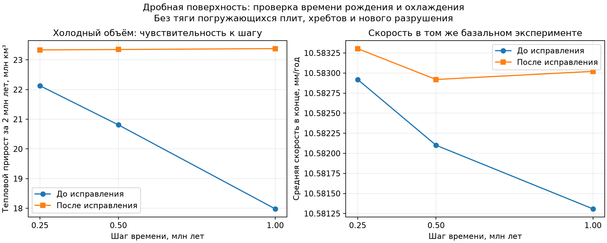

# Исправление времени рождения и охлаждения дробного материала

30.09.2026. Рабочая копия: `D:\Moon Project\mantle-convection`, ветка
`fix/genesis-mantle-convection`. Продолжение
[связанного эксперимента с базальными силами](FRACTIONAL_COUPLING_IMPLEMENTATION.md).

Следующий реализованный этап: [геометрия контактов внутри смешанных ячеек](GEOMETRIC_CONTACT_IMPLEMENTATION.md).

Исправлен основной источник зависимости нового холодного объёма от шага.
Рождение коры и удаление материала распределяются по времени внутри
транспортного интервала. Возраста разных порций остаются раздельными;
удалённый материал охлаждается на момент удаления.

При уменьшении шага 0,5→0,25 млн лет расхождение теплового прироста холодного
объёма снизилось с **6,34% до 0,0556%**, примерно в **114 раз**. При
1→0,5 млн лет — с **15,74% до 0,131%**. Это проверка численной точности
на коротком интервале, а не установление сходимости всей модели.

Основная механика 0.5 и GUI не изменены. Эксперимент по-прежнему включает
только базальные силы; тяга погружения, силы хребтов, разрушение и изменение
топологии ещё не подключены к дробному состоянию.

## Подтверждённая причина

В прежней схеме вся новая кора появлялась в конце шага с нулевым возрастом.
Хотя образование шло в течение интервала, новое вещество не охлаждалось
до следующего шага. Это систематически занижало холодный объём на крупных
шагах. Удалённые порции имели возраст конца шага, но холодные свойства его
начала.

Причина проверена отдельно от изменения динамики. Для сохранённых конечных
распределений выполнен аналитический интеграл локальной холодной толщины по
равномерному времени рождения. Оценка общего теплового прироста получилась
23,3302 / 23,3323 / 23,3314 млн км³ на шагах 1 / 0,5 / 0,25 вместо прежних
17,9808 / 20,8116 / 22,1304 млн км³. Это диагностическая оценка при фиксированных
конечных площадях; она не подменяет новые динамические прогоны ниже.

Данные: [audit_decomposition.json](analysis/fractional_time_validation/audit_decomposition.json),
[audit_quadrature.json](analysis/fractional_time_validation/audit_quadrature.json).

## Реализация

В [fractional_transport.py](tectonics/fractional_transport.py) добавлена
необязательная положительная квадратура времени событий. Новый связанный
режим `gauss2_v2` использует два узла внутри каждого интервала Куранта:

`t₁,₂ = t_start + (1/2 ∓ √3/6) · Δt`, веса — `1/2` и `1/2`.

Расходы рождения и удаления внутри такого интервала пока считаются
постоянными. Каждый узел создаёт собственную материальную историю с новым
идентификатором и нулевым возрастом в момент рождения. К концу шага она
получает соответствующий положительный возраст. Разные возраста не заменяются
средним; охлаждение вычисляется отдельно для каждой группы.

Сначала проверяется консервативная транзакция переноса. Затем возраста
новорождённых групп приводятся к конечному времени. Записи рождения в
балансе остаются нулевого возраста и с нулевой холодной массой. Это позволяет
отделить химическое создание коры от последующего охлаждения.

В [fractional_thermal.py](tectonics/fractional_thermal.py) добавлен
`refresh_parcel_mechanics`: прежний закон охлаждения теперь применим к
произвольному набору удалённых порций без искусственного заполнения ячеек.

В [fractional_coupling.py](tectonics/fractional_coupling.py) каждая снятая
группа получает свойства на собственный момент удаления. Для этого берётся
последний предшествующий принятый тепловой образец Genesis, а его копия
продолжается до времени события. Глобальный конечный тепловой контекст
остаётся результатом единственного основного продолжения Genesis. Дополнительные
вычисления нужны только для механических свойств событий и не отнимают
энергию из глобальных резервуаров повторно.

В материальном балансе теперь учитываются оба тепловых вклада:

`остаток + охлаждённое удалённое − рождённое − охлаждение остатка − охлаждение удалённого = начальный запас`.

Архивированные ранее порции повторно не охлаждаются и не списываются.
Чистая транспортная диагностика показывает холодные свойства до обновления;
разница с охлаждённым архивом явно записана в `removed_cooling`.

## Новые динамические результаты

Одинаковый исходник — поверхность сохранения 0.5 после 50 млн лет, одинаковые
физические параметры, продолжение на 2 млн лет. Ни мантийная нагрузка,
ни сопротивление, ни коэффициенты охлаждения не подбирались под скорость.

| Шаг, млн лет | Холодный прирост до исправления, км³ | После исправления, км³ | Средняя скорость после исправления, мм/год |
|---:|---:|---:|---:|
| 1 | 17 980 797,81 | 23 380 859,14 | 10,583021 |
| 0,5 | 20 811 610,10 | 23 350 125,45 | 10,582920 |
| 0,25 | 22 130 397,97 | 23 337 147,79 | 10,583304 |

Относительные изменения при уточнении шага:

| Величина | 1→0,5 млн лет | 0,5→0,25 млн лет |
|---|---:|---:|
| Тепловой прирост холодного объёма, прежде | +15,7435% | +6,3368% |
| Тепловой прирост холодного объёма, теперь | −0,13145% | −0,05558% |
| Тепловой прирост избыточной массы, теперь | −0,14388% | −0,06085% |

Это проценты относительно приращения за интервал, а не всего холодного
запаса. Скорость почти не изменилась; результат исправления — более точный
учёт возраста и отрицательной плавучести. Приведённые скорости относятся
к базальному эксперименту и не заменяют результаты полной механики 0.5.



Все численные результаты и контрольные суммы:
[validation_summary.json](analysis/fractional_time_validation/validation_summary.json).

## Проверки

**291 тест прошёл за 55,49 с.** К прежним 260 добавлена 31 проверка событий
и произвольных тепловых порций. Проверены:

- первый и второй моменты возрастов равномерно создаваемого материала;
- независимый аналитический интеграл холодной толщины по времени рождения;
- сохранение каждого материального происхождения и всех четырёх величин;
- физические часы при нескольких интервалах Куранта внутри одного шага;
- охлаждение снятого материала на время события и отсутствие повторного
  изменения ранее сохранённого архива;
- неизменность главного теплового контекста относительно прямого Genesis;
- точное продолжение всех возрастов, тепла, архива и накопленных вкладов;
- явный выбор прежнего режима сохранения, неверные узлы и веса квадратуры.

Проведены шесть реальных расчётов: молодой Starter, три шага для позднего
источника и две части продолжения. Максимальные относительные невязки:
материала — 1,44×10⁻¹⁶, глобальной энергии — 4,46×10⁻¹⁴. Сохранение после
непрерывных 2 млн лет побитово совпадает с сохранением после двух запусков
по 1 млн лет. Все исходные файлы и production-файлы механики 0.5 остались
неизменными.

Прежний режим `endpoint_v1` также воспроизвёл настоящий старый checkpoint
побитово: [legacy_compatibility.json](analysis/fractional_time_validation/legacy_compatibility.json).
Журнал тестов: [final_tests.log](analysis/fractional_time_validation/final_tests.log).

## Запуск

Новый режим включён по умолчанию только в экспериментальном скрипте:

```powershell
Set-Location 'D:\Moon Project\mantle-convection'
$env:QT_QPA_PLATFORM = 'offscreen'
$env:CUPY_CACHE_DIR = 'D:\Moon Project\mantle-convection\.venv\cupy-cache'
& .\.venv\Scripts\python.exe run_fractional_coupling_probe.py --source analysis/slab_sinking_followup/runs/ordered_sub4_dt1/elapsed_0050 --output results/fractional_events_v2_52 --duration-myr 2 --step-myr 0.25
```

Готовое проверенное сохранение находится в
`analysis/fractional_time_validation/runs/late_dt0p25/fractional_checkpoint.json`.
Его можно продолжить в новую папку через `--resume`, сохранив тот же `--source`.
Формат связанного checkpoint обновлён до `fractional-heat-basal-coupling-2`.
Старые файлы версии 1 продолжаются только с явным `--time-scheme endpoint_v1`;
они не превращаются молча в новые истории рождения. Прежний проверочный
скрипт также закреплён за старой схемой для воспроизведения старого отчёта.

## Ограничения и следующий этап

Два узла — приближение интеграла по времени. Закон охлаждения содержит
корень возраста и переход через толщину коры, поэтому формальный высокий
порядок на всём диапазоне не заявляется. В отдельном аналитическом тесте
для почти нулевой толщины коры ошибка двух узлов составляет 1,083%, четырёх —
0,174%, восьми — 0,0253%. Это другая проверка, не относительное расхождение
полного динамического результата в таблице.

Силы и пространственный перенос остаются первого порядка. При выборе
удаляемого материала приоритет ещё использует перенесённые холодные свойства
начала шага. Сходимость по сетке и на долгих временах не установлена.
На самом подробном прогоне осталось 171 003 порции; рост числа историй
по-прежнему требует внимания к производительности.

Следующий необходимый этап — **сохраняемая геометрия контактов**. Одни доли
площади не определяют, где внутри смешанной ячейки проходит граница, каковы
её длина и направление и какой контакт принимает конкретную порцию.
До появления этих данных нельзя корректно подключить силы хребтов,
шейку погружающейся плиты и её тягу. Подготовлен
[план геометрического этапа](analysis/fractional_time_validation/CONTACT_GEOMETRY_NEXT.md).
