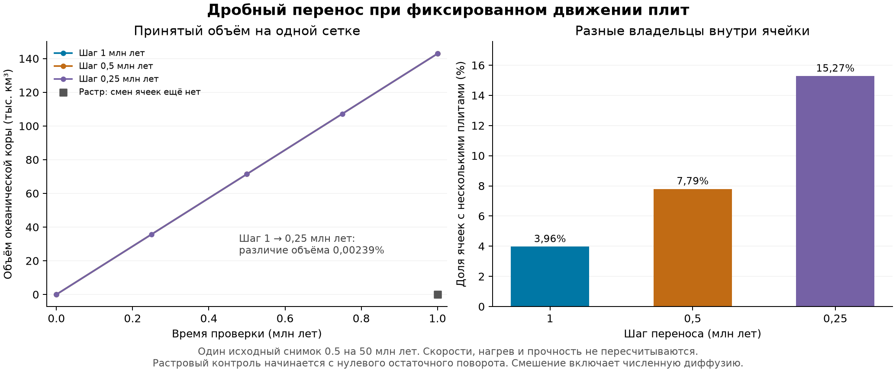

# Дробный перенос материала: самостоятельный проверяемый этап

Продолжение от 30.09.2026: [связанный эксперимент с охлаждением и базальными силами](FRACTIONAL_COUPLING_IMPLEMENTATION.md).
Ниже описан предыдущий эксперимент с фиксированными скоростями;
полная механика 0.5 и GUI пока используют прежнее представление поверхности.

Рабочая копия: `D:\Moon Project\mantle-convection`, ветка
`fix/genesis-mantle-convection`. Это следующий этап после
[механики 0.5](SLAB_COHORT_GEOMETRY_IMPLEMENTATION.md).

Реализован самостоятельный расчёт переноса океанического материала долями
ячеек. Он хранит несколько владельцев и материальных историй в одной ячейке,
считает потоки между соседними ячейками и сохраняет результат для продолжения.
**Этот режим пока не включён в связанный расчёт скоростей, тепла и разрушения
плит.** Его эксперименты задают фиксированные угловые скорости из исходного
сохранения и проверяют перенос, а не прогнозируют новую скорость плит.

## Почему потребовалось отдельное представление поверхности

В механике 0.5 поверхность хранит один материал-победитель на ячейку.
Вместе с ним перемещаются возраст, память повреждений и прочность.
Частичное списание одного только базальтового объёма оставило бы полную
площадь этой ячейки на поверхности. Старый код истолковал бы остаток как
более тонкую кору; последующее обновление холодной мантии могло бы даже
увеличить её толщину. При перескоке растра полная площадь и холодная масса
могли бы второй раз попасть в погружённый материал.

Поэтому новый расчёт переносит вместе четыре обширные величины:

- занятую площадь;
- объём океанической коры;
- объём холодной мантии;
- избыточную массу, создающую отрицательную плавучесть.

У каждой порции остаются собственные идентификатор материала, владелец,
возраст, повреждения, напряжения, доступ воды и прочность. Возраст двух
разных порций не заменяется средним: нелинейный закон охлаждения не даёт
на среднем возрасте того же результата, что на отдельных возрастах.

## Реализованный численный метод

[fractional_surface.py](tectonics/fractional_surface.py) задаёт неизменяемое
состояние и транзакции. Сохранённые и удалённые доли в сумме исчерпывают
ровно исходную порцию. Одинаковая доля применяется ко всем четырём
обширным величинам. Проверяются происхождение, материальная история,
неотрицательность и заполнение каждой ячейки. Новое вещество получает
новый идентификатор. Ошибочная транзакция не изменяет исходное состояние.

[fractional_transport.py](tectonics/fractional_transport.py) использует
метод конечных объёмов первого порядка. Поток жёсткого вращения через
сферическое ребро вычисляется по его концам:

`Q = R² · sign · omega · (u − v)`.

Знак задаёт внешнюю нормаль из первой ячейки во вторую. Разности концов
вокруг треугольника взаимно сокращаются: одно жёсткое вращение не создаёт
дивергенцию площади. Условие Куранта ограничивает суммарный расход донора;
при необходимости шаг делится на части. Порция следует скорости своей
плиты, даже если эта плита занимает меньшинство площади ячейки.

При избытке площади преимущественно удаляется более отрицательно плавучий,
затем более старый океанический материал. При равных свойствах удаление
делится пропорционально; номер плиты не задаёт полярность. Реальная
незаполненная площадь получает новорождённый материал с нулевым возрастом
и холодной массой. Владение им распределяется между уходящими плитами по
их вкладу в освобождение площади. Это явно заданное локальное приближение;
геометрия внутриклеточной траншеи или хребта не восстанавливается.

Первый порядок сохраняет положительность и бюджет, но размывает границы.
Численный подход сопоставлен с первичным источником по сферическому
консервативному переносу:
[Skamarock и Gassmann, 2011](https://www2.mmm.ucar.edu/people/skamarock/Papers/cv_47.pdf).
Использованный здесь простой метод не воспроизводит их схему высокого порядка.
[Вывод потока и границы применимости](analysis/fractional_transport_validation/TRANSPORT_PHYSICS.md).

## Импорт, сохранение и сетка

[fractional_surface_io.py](tectonics/fractional_surface_io.py) импортирует
фактические поля океанического состояния и память Starter. Ненулевые
континентальные и осадочные резервуары отклоняются явно, включая невидимые
в растре малые примеси. Они требуют собственного закона переноса и коллизий.

Новый файл `fractional_checkpoint.json` имеет отдельный формат, контрольную
сумму содержимого и отпечаток геометрии. Он сохраняет меньшинства,
идентификаторы, все истории и бюджет эксперимента. Продолжение требует того
же источника, заданных скоростей и параметров рождения коры. Существующий
файл не перезаписывается. Это не файл продолжения основной механики 0.5.

Иерархическое измельчение делит каждую порцию по площадям её настоящих
дочерних треугольников. Материальные истории остаются раздельными; поправка
округления остаётся внутри дочерних частей того же донора. Измельчение
не создаёт новую информацию о расположении порций внутри исходной ячейки.

Проверка на реальном состоянии выявила отдельную ошибку округления:
сумма независимо вычисленных сферических площадей детей немного отличается
от площади родителя. Исправление остатка только у материала создавало ложное
перекрытие внутри одной плиты. Теперь вместимость дочерних ячеек и материал
используют одну наследуемую меру площади; она сохраняется в checkpoint.
Отклонение от прямой геометрической квадратуры ограничено исходным допуском
2×10⁻¹³. Проверка наличия другой принимающей плиты не ослаблялась.

## Границы этого этапа

Температурные и механические свойства в эксперименте заморожены; возраст
переносится и увеличивается с временем. Глобальная энергия Genesis не
пересчитывается и дополнительный тепловой резервуар не создаётся.

Прежний путь растра и новая транзакция не запускаются последовательно над
одним материалом. Возврата дробного состояния в одну усреднённую запись
на ячейку нет. Подключение к основному расчёту требует:

1. Вычислять охлаждение и механическую поддержку для каждой порции,
   интегрировать силы по её площади и владельцу.
2. Согласовать геометрию контактов с несколькими владельцами и передавать
   погружённые порции в slab-регистр один раз с их собственным временем.
3. Перевести повреждения, разломы и изменение топологии на тот же материал;
   обработать континентальные и осадочные резервуары.
4. Проверить связанный расчёт, продолжение, смену сетки и сходимость по
   времени, прежде чем менять версию по умолчанию.

Ни коэффициент ускорения плит, ни новый порог обрыва здесь не вводится.
Число различимых историй растёт; мелкие порции не удаляются ради экономии
памяти. До длительных расчётов потребуется измерить стоимость хранения
и выбрать схему уменьшения численного размывания.

## Запуск самостоятельной пробы

Из рабочей копии через её окружение:

```powershell
& .\.venv\Scripts\python.exe run_fractional_transport_probe.py `
  --source analysis/slab_sinking_followup/runs/ordered_sub4_dt1/elapsed_0050 `
  --output analysis/fractional_transport_validation/my_probe `
  --duration-myr 1 --step-myr 0.25
```

Выходной каталог должен быть новым. В нём появятся `report.json` и
`fractional_checkpoint.json`. Для продолжения нужно добавить
`--resume <путь-к-fractional_checkpoint.json>`, оставить тот же `--source`
и указать новый выходной каталог. `--duration-myr` в этой утилите означает
длительность дополнительного участка, а не абсолютный возраст.

Базовые наблюдения и перечень проверок сохранены в
[TEST_MAP.md](analysis/fractional_transport_validation/TEST_MAP.md) и
[baseline.json](analysis/fractional_transport_validation/baseline.json).

## Проверенные результаты

**137 целевых тестов прошли за 23,65 с**: дробные транзакции, геометрия
потоков, память материала, сохранение/продолжение, измельчение сетки,
прежний консервативный перенос и совместимость старой slab-механики.
[Журнал тестов](analysis/fractional_transport_validation/final_after_area_tests.log).

Реальный запуск утилиты из сохранения 0.5 на 50 млн лет, с фиксированными
скоростями на дополнительный 1 млн лет и шагом 0,5 млн лет, завершён.
Удалено из поверхности 146 341,88 км², или 142 927,33 км³ океанической
коры; все четыре глобальных бюджета закрылись с относительной невязкой
не более 1,70×10⁻¹⁶. Число порций выросло с 5120 до 23 665.

[Отчёт запуска](analysis/fractional_transport_validation/cli_final_dt0p5/report.json)
и [готовое самостоятельное сохранение](analysis/fractional_transport_validation/cli_final_dt0p5/fractional_checkpoint.json).
Это перенос при заданном движении: данные не означают, что такие объёмы
приняты силовой моделью 0.5 или что скорость плит увеличилась.

В независимой серии из того же состояния за одинаковый интервал 1 млн лет:

| Сетка | Шаг, млн лет | Удалено океанической коры, км³ |
|---|---:|---:|
| subdivision 4 | 1 | 142 929,567 |
| subdivision 4 | 0,5 | 142 927,329 |
| subdivision 4 | 0,25 | 142 926,149 |
| subdivision 5, тот же материал после измельчения | 1 | 144 387,137 |



Изменение объёма между шагами 1 и 0,25 млн лет — около 0,0024%, между
сетками — около 1,02%. Разница распределения площади между последовательными
парами временных шагов уменьшилась с 6,41×10⁻⁶ до 3,17×10⁻⁶ площади сферы.
Это полезные результаты короткой пробы **при фиксированных скоростях**;
они не заменяют сходимость будущей связанной модели.

Проверены бюджеты каждого идентификатора материала, а не только глобальные
суммы. Наибольшая относительная невязка в шести пробах — 1,34×10⁻¹⁵.
При общем вращении всех плит рождение и поглощение материала точно равны
нулю. Перезапуск после половины интервала воспроизводит дробное состояние
побитно. Исходные файлы и состояние не изменились.

Отдельная проба из исходного Starter при его фиксированных скоростях
переносит в потерю 47,075 км³ уже за первый 1 млн лет, когда прежняя
растровая карта ещё не делает ни одного перескока. Это демонстрация снятия
численного порога переноса, а не новый результат эволюции Starter.

[Полные результаты сравнения](analysis/fractional_transport_validation/actual_frozen_v2/validation.json).
[Краткий манифест проверок и контрольные суммы](analysis/fractional_transport_validation/validation_summary.json).
Рост числа смешанных ячеек при уменьшении шага включает численное
размывание границ. На шаге 0,25 млн лет после четырёх шагов хранится
54 178 порций: стоимость хранения остаётся существенным ограничением.
