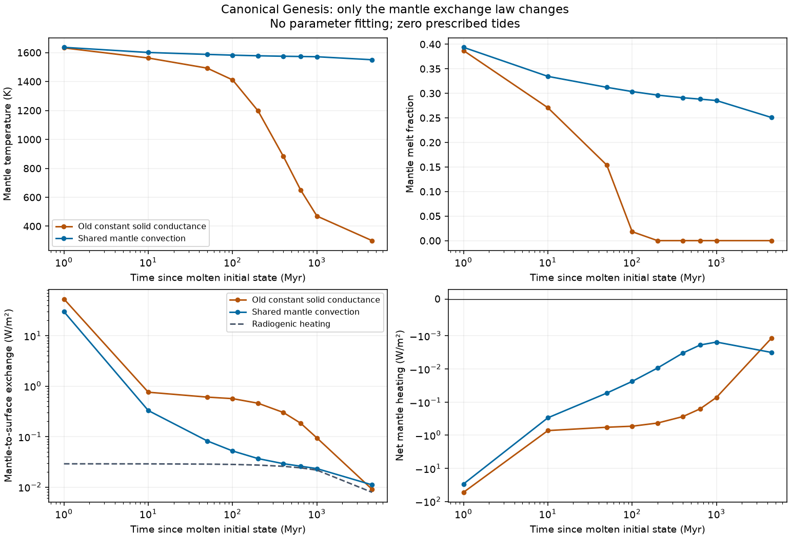

# Genesis: общий закон теплоотдачи мантии, 28.09.2026

Изменение выполнено в `fix/genesis-mantle-convection`, отдельной рабочей копии
`D:\Moon Project\mantle-convection`, от `perf/gpu-compute` (`72da5ad`).
Слияния с исходной веткой нет. Параметры не подбирались под конечную температуру.

## Причина и полный путь тепла

В прежней модели после затвердевания оставалась постоянная проводимость
`h_solid = 0.0005 W/m²/K`. При охлаждении менялся почти исключительно перепад
температур, а рост вязкости не ослаблял конвекцию. Это поддерживало чрезмерный
отток из глобального резервуара на сотнях миллионов лет. Проекция в mature
одновременно показывала `eta/Ra/Nu` другой модели — эти числа не объясняли
поток, реально вычтенный из энтальпии.

Единственный владелец глобальной энергии остался в `tectonics/genesis.py`:

```
dE_m/dt = q_rad + q_tide - q_exchange
dE_s/dt = q_exchange + F_star_abs + F_giant_abs - OLR
```

Все потоки здесь в W/m², энтальпии в J/m². Скрытая теплота силикатов и воды,
разделение масс резервуаров, пар, океан и интегральные входной/выходной
энергетические счета сохранены. Радиогенная мощность по прежнему соглашению
вычисляется из общей силикатной массы и поступает один раз в недра.

Путь вызовов:

- `genesis.advance` интегрирует обе энтальпии и ledger неявным Radau;
- `genesis_onset.advance_orbit_thermal` передаёт средний за интервал приливный
  нагрев из орбитального бюджета и согласует терминальное событие;
- `genesis_starter_loading.StarterLoadingModel` и `genesis_coupled_thermal`
  используют этот же интегратор. Их пассивные колонки получают только Tm/Ts
  и ведут собственный boundary ledger; их тепло не прибавляется к мантии;
- `genesis_starter_continuation.YoungWorldCoupling.advance_heat` продолжает
  тот же GenesisState. `project_thermal` формирует только представление для
  mature-runner; новый `ThermalState` не становится вторым интегратором;
- `genesis_long_term_support` продолжает механическую оценку толщины после
  исчерпания глубины колонки, не меняя глобальный тепловой закон;
- обычные mature-запуски продолжают использовать прежний `thermal.py` API,
  теперь вызывающий общую реализацию. Его числа и схема истории сохранены.

## Общая физика и её параметры

В `tectonics/mantle_convection.py` вынесена ровно существовавшая mature-формула:

```
eta(Tm) = clip(eta_ref exp[Ea/Rgas (1/Tm - 1/Tref)], eta_min, eta_max)
D = radius * mantle_depth_fraction_radius
DeltaT_unstable = max(Tm - Ts, 0)
Ra = rho g alpha DeltaT_unstable D³ / (kappa eta)
Nu = 1                                      при Ra <= Ra_critical
Nu = max(1, a (Ra/Ra_critical)^beta)          иначе
h_solid = k Nu / D
q_solid = h_solid (Tm - Ts)
delta_thermal = D / Nu
```

При `Tm=Ts` обмен равен нулю. Для обратного градиента `Ra=0`, `Nu=1` и
обмен направлен внутрь (в твёрдой ветви — теплопроводностью). Genesis не получил ни температурного
floor, ни поправки по возрасту. Mature-обёртка сохраняет свой прежний минимум
перепада 1 K и прежний порядок операций для точной численной совместимости;
этот минимум не используется в новом двухрезервуарном пути.

Значения по умолчанию совпадают с прежними `ThermalParameters`:

| Параметр | Значение | Смысл/статус |
|---|---:|---|
| `mantle_depth_fraction_radius` | 0.45 | Эффективная геометрия мантии; D=2379.15 км |
| `mantle_density_kg_m3` | 4000 | Приближённая плотность |
| `thermal_conductivity_w_m_k` | 4 | Теплопроводность |
| `thermal_expansivity_per_k` | 3e-5 | Объёмное расширение |
| `thermal_diffusivity_m2_s` | 1e-6 | Эффективная диффузивность |
| `viscosity_reference_pa_s`, `viscosity_reference_temperature_k` | 1e21; 1600 | Опорные реологические параметры, не целевая T |
| `activation_energy_j_mol` | 3e5 | Эффективная энергия активации |
| `viscosity_min_pa_s`, `viscosity_max_pa_s` | 1e18; 1e24 | Унаследованные границы применимости реологии |
| `critical_rayleigh` | 1000 | Эмпирический порог |
| `nusselt_prefactor`, `nusselt_exponent` | 0.27; 1/3 | Эмпирическая нормировка и степень |

Это параметры эффективной модели, а не измеренные свойства данного спутника.
Нормировка сохранена именно как `0.27*(Ra/1000)^(1/3)`, не `0.27*Ra^(1/3)`.
При данной нормировке `Nu` остаётся 1 и некоторое время выше Ra=1000.
Она не была перекалибрована. `kappa` задана независимо от `k/(rho cp)`, как и
в mature; это дополнительное приближение исходной модели. Границы вязкости
также сохранены: при достаточно холодной мантии eta перестаёт расти, но Nu
уже достигает проводящего предела и поток остаётся малым.

## Плавный переход и три разные толщины

Сохранены интервалы доли расплава 0.25–0.55 и магматическая проводимость
100 W/m²/K. При `x=clip((phi-0.25)/0.30,0,1)`:

```
w = x² (3-2x)
log(h) = (1-w) log(h_solid(Tm,Ts)) + w log(h_magma)
q_exchange = h (Tm-Ts)
```

Геометрическая интерполяция учитывает изменение проводимости на много
порядков, сохраняя положительное сопротивление и непрерывную первую
производную у концов перехода. Арифметическая смесь дала бы заметный канал
в 100 W/m²/K уже при ничтожном весе расплава. Энергия/температура при смене
ветви не пересоздаются. Закон перехода остаётся эмпирическим: он не является
расчётом проницаемости кристаллической каши, вязкости двухфазной среды или
переноса расплава. Длительное пребывание в этом диапазоне надо читать вместе
с `magma_transport_weight` и двумя разными потоками `q_solid`/`q_exchange`.

`D/Nu` — эквивалентная тепловая длина **твёрдой ветви**, даже когда обмен
ещё усилен расплавом. Фактическую проводимость смешанного режима показывает
`effective_heat_transfer_w_m2_k`. eta/Ra/Nu также относятся к твёрдой ветви;
в полностью расплавленном режиме это справочная экстраполяция, а не вязкость
жидкой магмы или диагностированная твёрдая крышка. Ни одна из этих величин не равна автоматически
механической толщине колонки или химической толщине коры. Для совместимости
с силами mature-runner у проекции историческое поле
`ThermalState.thermal_lithosphere_thickness_km` продолжает содержать
механическую оценку; в её диагностике это явно повторено как
`mechanical_lithosphere_thickness_km`, отдельно от теплового `D/Nu`.

`convective_traction_pa`, `basal_drag_pa_s_m`, `force_speed_scale`, damage,
slab pull, ridge push и continental cycle не изменены. Физические силы могут
реагировать на новую температуру через прежние связи; это не новая настройка
механики и не доказательство запуска подвижных плит.

## Диагностика и совместимость сохранений

Genesis, Starter и continuation history содержат Tm/Ts, melt, eta, Ra, Nu,
`solid_convective_heat_flux_w_m2`, `mantle_to_surface_flux_w_m2`, радиогенный
и приливный нагрев, `net_mantle_flux_w_m2` (плюс означает нагрев),
`thermal_boundary_layer_thickness_km`, фактическую проводимость и вес расплава.
Старое `net_cooling_flux_w_m2` означает суммарное охлаждение обоих резервуаров
через атмосферу; его нельзя подменять чистым потоком из мантии.
У continuation legacy `convective_heat_flux_w_m2` по прежнему означает
фактический `q_exchange`; новое поле solid-потока отделяет две величины.

`genesis.schema_version: 1` остаётся допустимой схемой конфигурации: новые
числовые поля имеют явные значения по умолчанию. Старый положительный
`solid_transfer_w_m2_k` сохранён в dataclass/JSON, но игнорируется во всех
ветвях нового закона. Загрузка конфига с этим полем выдаёт DeprecationWarning.

Checkpoint привязан к `genesis-thermal-0.2`. Старые Genesis, Shell, Onset,
Mobile, Fault, Starter и продолжающие их Contact/Coupled/Starter-continuation
сохранения отвергаются с понятным сообщением: историю надо пересчитать с
исходного расплавленного состояния. Нельзя молча продолжить старую кривую
под новой физикой. Новые сохранения включают версию, все реологические
параметры и прежние проверки hash/fingerprint. Текущие checkpoint/resume
сохраняют детерминизм на тех же границах шагов. Обычные mature-сохранения
не инвалидируются этим изменением.

## OLR и границы физических выводов

OLR зависит от **температуры поверхности**, а не непосредственно от Tm.
Для исходного водного столба паровая ветвь практически полностью насыщена:

| Ts, K | OLR, W/m² |
|---:|---:|
| 2300 | 13896.568980 |
| 2000 | 1733.615851 |
| 1800 | 372.725991 |
| 1600 | 282.000000 |

Дополнительная ранняя история (`early_history.csv`) даёт новую Tm:
2265.207 K в 0.001 Myr, 2088.716 K в 0.01 Myr, 1859.745 K в 0.1 Myr,
1718.567 K в 0.5 Myr и 1636.188 K в 1 Myr. Расплавленный старт по прежнему
остывает быстро; изменение позднего сопротивления не отменяет горячее окно.

Значения OLR следуют из `282 + sigma*max(Ts-1600,0)^4`, ограниченного серой сухой
ветвью. Поглощённый звёздный поток равен 224.726012 W/m². В начале потери
в космос действительно велики, поэтому быстрое раннее охлаждение само по
себе не ошибка интегратора. Формула, единицы и переход через 1600 K проверены;
физическая точность горячего окна этим не подтверждена. Спектральная
непрозрачность, облака и структура атмосферы не рассчитываются. OLR оставлен
без изменений и остаётся самостоятельным ограничением модели.

Использованный scalar Ra/Nu закон не выбирает mobile-lid или stagnant-lid
по контрасту вязкости оболочки, пределу текучести или истории разрушения.
`Nu=1` — проводящий предел, не доказательство режима stagnant lid. Нет
самостоятельного баланса растущей тепловой крышки, давления, сложной
реологии/состава, скрытого внутреннего тепла ядра или разрешённой 3-D конвекции.
Работы [Solomatov (1995)](https://profiles.wustl.edu/en/publications/scaling-of-temperature-and-stress-dependent-viscosity-convection/)
и [Foley & Bercovici (2014)](https://academic.oup.com/gji/article/199/1/580/733317)
показывают, почему различение режимов требует дополнительных реологических
зависимостей. Наша модель использует более простую унаследованную
параметризацию; её коэффициенты не извлечены из этих работ.

## Воспроизведение и результаты

Диагностический сценарий и CSV/JSON лежат в
`analysis/genesis_mantle_transport_validation.py` и
`analysis/thermal_transport_validation/`. Внутри сценария старый закон
включается только для контрольного прогона; production-переключателя на
устаревшую физику нет. Условия, шаги, обе истории, бюджет и проверки
сходимости сохраняются вместе с результатами.

```powershell
& '..\gpu-compute\.venv\Scripts\python.exe' analysis/genesis_mantle_transport_validation.py --include-orbit
& '..\gpu-compute\.venv\Scripts\python.exe' -m pytest tests -k 'genesis or thermal or mantle_convection' -q
```

Все результаты ниже относятся к исходным параметрам, без настройки
температуры. Длинный тепловой опыт не является прогоном всей механики плит
на 4.5 млрд лет; связь с настоящим continuation проверяется отдельно тестами.

### Сравнение старого и нового бюджетов

Канонический опыт без заданных приливов (`q_tide=0` во всех строках).
Единственное различие контрольных запусков — закон обмена мантия/поверхность.
Температуры в K, потоки в W/m², положительный net означает нагрев.

| Myr | Tm old | Tm new | q_exchange old | q_exchange new | q_rad | net old | net new |
|---:|---:|---:|---:|---:|---:|---:|---:|
| 0 | 2300.000 | 2300.000 | 0 | 0 | 0.0289038 | 0.0289038 | 0.0289038 |
| 1 | 1632.253 | 1636.188 | 53.0545 | 29.7424 | 0.0288954 | -53.0256 | -29.7135 |
| 10 | 1562.439 | 1600.707 | 0.756182 | 0.327807 | 0.0288204 | -0.727362 | -0.298987 |
| 50 | 1492.280 | 1587.319 | 0.60495 | 0.0820554 | 0.0284894 | -0.576461 | -0.053566 |
| 100 | 1410.924 | 1582.156 | 0.564279 | 0.051891 | 0.028081 | -0.536198 | -0.02381 |
| 200 | 1197.346 | 1577.807 | 0.457507 | 0.0366527 | 0.0272815 | -0.430225 | -0.00937114 |
| 400 | 882.102 | 1574.597 | 0.299909 | 0.0290514 | 0.0257503 | -0.274159 | -0.003301 |
| 640 | 650.534 | 1572.900 | 0.184144 | 0.0259181 | 0.0240259 | -0.160118 | -0.0018922 |
| 1000 | 469.903 | 1571.154 | 0.093842 | 0.0231999 | 0.0216534 | -0.0721886 | -0.00154657 |
| 4500 | 300.291 | 1550.410 | 0.00904953 | 0.0110644 | 0.00787995 | -0.00116958 | -0.00318446 |

Диагностика нового закона в тех же точках (eta в Pa·s, длина в км):

| Myr | Ts | melt | eta | Ra | Nu | q_solid, W/m² | D/Nu, км |
|---:|---:|---:|---:|---:|---:|---:|---:|
| 0 | 2300.000 | 1.000000 | 1.04539e+18 | 0 | 1 | 0 | 2379.150 |
| 1 | 291.111 | 0.393646 | 6.0728e+20 | 2.5485e+07 | 7.94558 | 0.0179685 | 299.431 |
| 10 | 282.292 | 0.334512 | 9.9009e+20 | 1.53216e+07 | 6.70603 | 0.0148647 | 354.778 |
| 50 | 282.215 | 0.312199 | 1.19741e+21 | 1.2541e+07 | 6.27298 | 0.0137644 | 379.269 |
| 100 | 282.205 | 0.303593 | 1.28961e+21 | 1.15983e+07 | 6.1117 | 0.0133575 | 389.278 |
| 200 | 282.201 | 0.296345 | 1.37327e+21 | 1.08554e+07 | 5.97831 | 0.0130224 | 397.964 |
| 400 | 282.198 | 0.290995 | 1.43881e+21 | 1.03352e+07 | 5.88126 | 0.0127792 | 404.531 |
| 640 | 282.197 | 0.288166 | 1.47484e+21 | 1.00695e+07 | 5.83042 | 0.0126521 | 408.058 |
| 1000 | 282.196 | 0.285257 | 1.51291e+21 | 9.80287e+06 | 5.7785 | 0.0125225 | 411.725 |
| 4500 | 282.193 | 0.250684 | 2.05709e+21 | 7.09362e+06 | 5.18784 | 0.0110616 | 458.601 |

В 10 Myr новая мантия всё ещё теряет 0.327807 W/m² при радиогенном
нагреве 0.0288204 W/m². В 4500 Myr потери снизились до 0.0110644 W/m²,
нагрев — до 0.00787995 W/m²: net отрицателен, и мантия продолжает охлаждаться.
Это не температурный floor и не достижение предписанной цели.

Существенная оговорка результата: melt сохраняется от 0.3345 в 10 Myr до
0.2507 в 4500 Myr. Следовательно, эта конкретная история почти всё время
содержит вклад эмпирического перехода, а не проверяет только полностью
твёрдую мантию. Параметры не менялись для ускорения её затвердевания.
Отдельные тесты холодной твёрдой ветви подтверждают рост eta и снижение Ra/Nu/потока
до проводящего предела и возможность как нагрева, так и охлаждения по бюджету.

### Одинаковое состояние: 1560 K / 282 K

Старый постоянный коэффициент даёт `0.0005*1278 = 0.639 W/m²`.
Но в полном прежнем коде при этих температурах melt=0.266667, поэтому
малый остаточный вес магмы 0.008916 повышает фактический old q до
**0.712470 W/m²**. В новой физике:

- eta = 1.782884e21 Pa·s;
- Ra = 8.247729e6, Nu = 5.455173;
- D/Nu = 436.127 км против эквивалентных `k/h_old = 8 км`;
- q_solid = **0.01172135 W/m²**;
- q_exchange с тем же плавным весом расплава = **0.01354337 W/m²**.

При источниках на 10 Myr q_rad=0.02882043 W/m² это меняет net с
−0.68364953 до **+0.01527706 W/m²**: новое состояние должно нагреваться.
Более горячее состояние реального прогона в 10 Myr всё ещё охлаждается;
направление эволюции определяется балансом, а не возрастом или заданной T.

### Численная и орбитальная проверка

При уменьшении max thermal step с 1 до 0.5 Myr (на раннем интервале
соответственно 0.01/0.005 Myr) максимальная разница Tm в контрольных точках
новой истории — 1.58e-7 K, Ts — 1.21e-6 K. Дополнительное разделение
внешних интервалов пополам изменяет Tm не более чем на 1.61e-8 K.
Новые события: surface_lid=0.755158, ocean_start=0.944817,
mantle_rheology=0.964741 Myr. Энергетическая невязка за 4.5 Gyr меньше
1e-11 относительно начального запаса; сохранение воды — до округления.

Второй опыт использует настоящий `advance_orbit_thermal`, как Starter:
канонические e=0.0002, k2/Q=0.003, изолированное затухание эксцентриситета.
Все приливные параметры также сохранены. Разница новой Tm с нулевыми
приливами составляет 0.002813 K в 1 Myr и 0.0000563 K в 10 Myr, затем
становится пренебрежимо малой. Орбитальный и полученный тепловой интегралы
совпадают с относительной точностью 1.06e-15. Эта слабая роль приливов
относится только к указанной изолированной орбите, не к резонансно
поддерживаемому эксцентриситету.



### Проверки интеграции и отдельно обнаруженная граница механики

Финальный прогон: **1970 passed, 616 deselected**, 298.15 s, без ошибок.
Версии среды и команда сохранены в `analysis/thermal_transport_validation/tests.json`.
`git diff --check` также проходит. Исходная `perf/gpu-compute` осталась чистой.

Добавлены проверки непрерывности потока/производной/энтальпии на обоих концах
перехода, обратного и нулевого температурного градиента, обратной связи
вязкости, нагрева/охлаждения холодного резервуара, ledger, пассивных колонок,
двух тепловых шагов, долгого checkpoint/resume и точного mature-регресса
по значениям, зафиксированным до рефакторинга. Настоящий
`YoungWorldCoupling.advance_heat` дополнительно сравнивается на 50–100 Myr
при внешних шагах 50 Myr и 5×10 Myr с неизменными внутренними controls.

Новый график охлаждения раньше выводит старую фиксированную shell-модель
за её предел малых деформаций: прежний тест с окончанием в 0.96 Myr
останавливается на грубом шаге в 0.894 Myr с `shell_small_strain_limit`.
При более мелких шагах активация первых частично несущих участков также
обнаруживает проблему применимости этой механической аппроксимации.
Это не невязка глобальной энергии и не основание менять тепловые или силовые
коэффициенты. Ограничители, механика и параметры оставлены прежними.

Чтобы тест сходимости повреждения не зависел от даты и дискретной активации
первых несущих ячеек, его fixture теперь задаёт уже связную ненапряжённую
молодую оболочку с согласованной энтальпией. Порог damage=0.65, тяга 50 kPa,
шаги и строгое требование к отношению ошибок <0.35 сохранены. Полученная
максимальная damage=0.7041–0.7046, отношения ошибок 0.3265–0.3323.
Тест исчерпания глубины колонки также больше не требует, чтобы физическая
история обязательно достигла её в старую дату. Эти изменения касаются
только тестовых состояний. Решение отдельной механической проблемы и
подтверждение mobile-lid не входят в это исправление теплопереноса.
