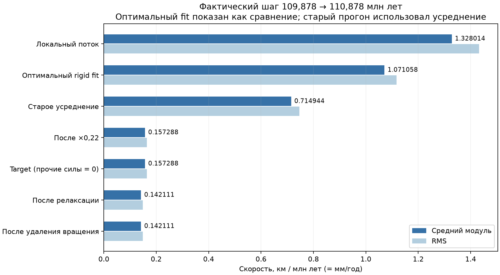
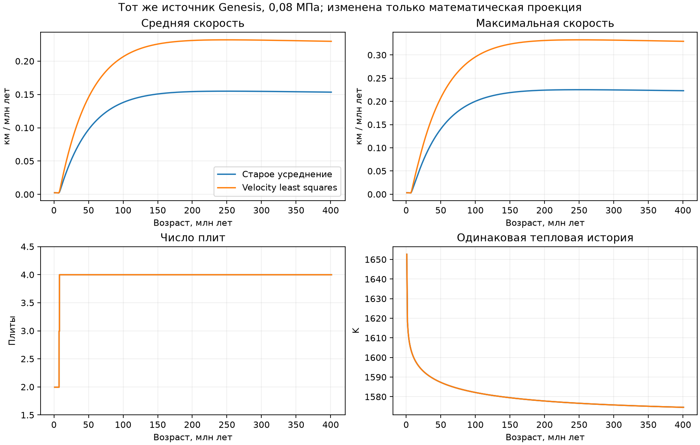

# Аудит скорости Genesis → Starter → mature, 29.09.2026

Исправлена математическая проекция мантийного поля на жёсткие плиты.
Коэффициенты не подбирались. При тех же 0,08 МПа средняя скорость на 400 млн лет
после partition изменилась с **0,153412** до **0,229706 км/млн лет**.
Медленный режим сохранился. Это устранение ошибки проекции, не подтверждение
полного физического torque balance или устойчивой мобильной тектоники.
Предыдущее незакоммиченное исправление thermal сохранено; коммитов нет.

## 1. Где уменьшается амплитуда

Источник: `results/genesis_runs/starter_20260928_192306_547551/starter_checkpoint.npz`.
Реальный GUI-run: `results/gui_runs/genesis_20260928_192334_470716`, checkpoint
`gui_checkpoint_0000110p8781_Myr`, thermal version `genesis-thermal-0.2`.
SHA256 источника и параметры — в `analysis/plate_velocity_validation/source.json`.

В момент первого partition (0,878121948 млн лет) механическая толщина оболочки
0,216162257 км. `mantle_traction` применяет
`c = 1 − exp(−h/2 км) = 0,102445224`. Номинальный масштаб `traction/drag`
25,24608 км/млн лет превращается после пространственной геометрии и coupling
в **RMS 1,453568142**. Гипотетический RMS того же поля при `c=1` — 14,188735097.

`independent_mantle_omega` сохраняет уже ослабленное поле. Импорт его не гасит.
На 110,878 млн лет RMS 1,432402999: последующая эволюция уменьшила амплитуду
лишь на 1,46%. Formation omega RMS 0,00027493792611544914 рад/млн лет,
текущий 0,0002709579901685077, realised fraction 0,985524238.

Coupling тонкой первой оболочки остаётся в formation field, хотя оболочка
позднее утолщается. Это отдельное ограничение модели источника. Убирать его
множителем 9,76 без согласования forcing и drag нельзя: например, закон
`τ_b = β c (u_m − u_p)` требует определить свободный мантийный поток и применить
coupling также к сопротивлению. Такой замены модели здесь не сделано.

## 2. Фактическое разложение и доли

Повтор 100,878 → 110,878 млн лет совпал с пользовательским checkpoint **побитово**
по всем массивам mature material, young thermal и fracture memory.
Ниже реальный последний шаг, не прогноз из замороженного состояния.
Средние взвешены по площади; км/млн лет численно равны мм/год.

| Этап | Средний модуль | RMS |
|---|---:|---:|
| Локальный мантийный поток | 1,328014368 | 1,432402999 |
| Оптимальное жёсткое вращение, для сравнения | 1,071057925 | 1,117089846 |
| Старое усреднение omega | 0,714943895 | 0,746499462 |
| После memory fraction 0,22 | 0,157287657 | 0,164229882 |
| Ridge / slab / GPE / rollback / resistance | 0 | 0 |
| Target | 0,157287657 | 0,164229882 |
| Current до шага | 0,141770330 | 0,148026967 |
| После релаксации | 0,142111353 | 0,148383053 |
| После удаления общего вращения, фактический результат | 0,142111353 | 0,148383053 |

По RMS local → лучший rigid fit оставляет **77,99% амплитуды / 60,82% квадрата
скорости**. Это геометрическая непредставимость неоднородного поля. Старое
усреднение теряет ещё **33,17% RMS** относительно правильного fit. Множитель
0,22 оставляет 22%; фактический результат здесь ещё на 9,65% ниже target.
В момент первого разделения residual был 0,999998473, represented kinetic
fraction 0,000003054. После двух дополнительных cuts и четырёх плит residual
стал 0,625940. Таким образом, ранний residual ≈1 нельзя переносить на поздние плиты.

`velocity_relaxation_myr=45`, `dt=1`, `alpha=0,0219771275154`. Трасса сохраняет
current/target/predicted/returned по каждой плите; формула воспроизводится точно.
Поздняя скорость приближается к медленному target: relaxation не объясняет его
низкую амплитуду. Общее вращение на последнем шаге порядка 10⁻²² рад/млн лет;
относительные скорости границ сохраняются с точностью округления. Cap не активен.



## 3. Пороговый барьер действительно есть

На сохранённом состоянии все **450 рёбер / 90 115,222 км** границ INACTIVE.
Максимальная относительная скорость 0,380692397, модуль нормальной —
0,361536011 км/млн лет, ниже порогов 1 и 4. Реальные знаки opening/convergence
есть, но classification выключает ridge/slab branches и рождение slab memory.

Потенциальный thermal ridge factor уже ≈0,750643; applied ridge drive нулевой
из-за отсутствия DIVERGENT. Young ridge floor остаётся нулевым. Slab zones,
length, depth, development и applied pull равны нулю. Отрицательная плавучесть
вещества не создаёт отсутствующую геометрию slab. Континентов и GPE нет;
rollback не имеет slab. Полные counts/lengths/mean/median/p90/max — в JSON.

Предложение следующего изменения: сохранить диагностические пороги, но
накапливать физическое сближение `dL/dt = 0,90 max(−v_n,0)` независимо от типа,
применяя прежнюю активацию `min(L/1800 км,1)` к реальному slab. Для ridge нужны
реальное раскрытие и ridge-to-flank thermal contrast, а не floor. Нормализация
не должна сокращать множитель активации. Это **предложено, но не внедрено**.
Полная схема — [BOUNDARY_PHYSICS_AUDIT.md](analysis/plate_velocity_validation/BOUNDARY_PHYSICS_AUDIT.md).
Перенос материала не полностью заперт классификацией: накопление субъячеечного
смещения и образование реальных геометрических gaps обрабатываются отдельно.

## 4. Математика и замена

Для единичных радиусов `r_i`, площадей `A_i` и скоростей `u_i`:

```
M = Σ A_i (I − r_i r_iᵀ)
b = Σ A_i r_i × (u_i/R)
M omega = b
```

Это минимум `Σ A_i |R omega×r_i − u_i|²`. Среднее локальных omega не решает
эту задачу и зависит от радиальной компоненты omega, не влияющей на скорость.
На глобальном exact rigid поле в касательном представлении Genesis старое
среднее даёт **2/3** правильного вращения. Starter уже использовал LS;
несоответствие появлялось после перехода в mature dynamics.

Добавлен `mantle.plate_rigid_mantle_fit` с residual, энергетической долей и
обработкой вырожденных областей. Genesis выбирает
`plate_dynamics.mantle_projection: velocity_least_squares`. Resume старого
Genesis-checkpoint без ключа сохраняет этот выбор в новой выходной конфигурации,
не меняя исходный архив. Явный `legacy_area_mean` уважается. Обычный mature
default сохраняет прежний способ проекции для совместимости.

## 5. Остаток и damage

Residual не полностью исчезал из damage: `YoungShellFracture` продолжает Starter
law с `smooth_mantle_tensor` того же potential field. Симметричный градиент
rigid rotation нулевой; деформирующая структура исходного поля сохраняется
в prescribed stress proxy. Но фактические `u_mantle − u_plate`, сглаживание
и эволюция mantle обратно в stress law не поступают.

Диагностика теперь вычисляет `β(u_m−u_plate)` в Па. Предлагаемый физический путь:
residual shear как нагрузка мембраны с удалёнными rigid modes → существующие
Maxwell stress/yield/damage → cut. Нужны условия на разломах, согласование
traction/drag и перенос stress memory. Проект описан в отдельном audit;
произвольной добавки скорости из residual нет.

## 6. Коэффициенты сохранены

Тяга **80000 Па**, drag **10¹⁴ Па·с/м**, memory **0,22**, force scale **0,65°/млн
лет**, relaxation **45 млн лет**, inactive **1**, normal **4 км/млн лет**,
ridge/slab gains, floors, caps и физические параметры источника не менялись.
Рабочий force scale на позднем шаге `0,65 × activity 0,35 = 0,2275°/млн лет`
следует прежнему правилу runner, а не новой калибровке.

## 7. Проверки

Exact rigid и mixed поля; независимый velocity-space LS oracle; radial gauge;
common rotation; relabeling; разные сетки; residual energy; сохранение relative
velocity; low-speed gate; отсутствие phantom ridge/slab; рост slab по интегралу
сближения; replay force vectors; ordinary mature default; реальные resume,
parallel workers и kernels с побитовым сравнением; thermal/material ledgers.
Итог: **57 focused tests прошли**, включая CPU/GPU; отдельный реальный
resume/parallel/kernel тест прошёл. Расширенный набор: **2064 passed,
2 failed, 553 deselected**. Два падения — прежние GUI-fixtures в
`test_gui_backend.py::test_checkpoint_introspection_and_spec_validation` и
`test_gui_resolution.py::test_resume_cannot_change_checkpoint_resolution`:
они задают `root/out` при требовании `root/results`. Эти тесты и
`moon_gui/backend.py` побайтово совпадают с HEAD (после нормализации CRLF);
падения воспроизводятся отдельно. GUI-правило и эти fixtures не изменялись.
Все команды и результаты: `analysis/plate_velocity_validation/tests.json`.

## 8. Old/new на одном источнике

Обе ветви: исходная subdivision4, шаг 1 млн лет, один Starter. Возраст равен
сроку после partition плюс 0,878121948 млн лет. Пользовательский checkpoint
с subdivision5 проверен отдельным точным replay, без смешения разрешений.

| После partition, млн лет | Плит | Старое mean / max | Новое mean / max |
|---:|---:|---:|---:|
| 5 | 2 | 0,002224 / 0,002852 | 0,002243 / 0,002876 |
| 50 | 4 | 0,098449 / 0,142282 | 0,147413 / 0,210106 |
| 100 | 4 | 0,138311 / 0,200771 | 0,207098 / 0,296554 |
| 200 | 4 | 0,154293 / 0,224242 | 0,231027 / 0,331245 |
| 400 | 4 | 0,153412 / 0,222990 | 0,229706 / 0,329398 |

Локальный mantle RMS и fit residual совпадают. Границы остаются INACTIVE;
ridge/slab activation, transport commits и continental generation нулевые.
Тепловая история совпадает **точно**, material ledgers замкнуты. Модуль thermal
energy residual на 400 млн лет 2,24·10⁻¹². Полные результаты —
[old_vs_new.csv](analysis/plate_velocity_validation/old_vs_new.csv).



## 9. Оставшаяся эмпирика

Boundary drives — dimensionless proxies, взвешенные длиной и нормированные
длиной активных force boundaries. Их переводит в omega `force_speed_scale`;
collision/transform factors гасят только relative drive. Это не SI torque
balance. Здесь оба сопротивления нулевые; объяснять медленность доминирующим
collision drag неверно. Медленный target задают ослабленный источник, геометрия
fit, memory fraction и нулевые boundary branches.

Следующий архитектурный этап — согласованный plate torque balance с basal drag,
ridge, slab и boundary resistance плюс непрерывное накопление геометрии. Он
отделён от исправленной ошибки LS. Скорость не объявляется физическим
доказательством ни земного режима, ни stagnant lid.

## Диагностический инструмент

Из папки `D:\Moon Project\mantle-convection`:

```powershell
& .\.venv\Scripts\python.exe analysis/diagnose_plate_velocity.py `
  results/gui_runs/genesis_20260928_192334_470716/gui_checkpoint_0000110p8781_Myr `
  --output analysis/my_velocity_audit
```

Проверяются SHA256. JSON содержит local/formation mantle statistics, каждую
плиту, fit/residual, границы, slab memory, raw/normalized force vectors,
relaxation и net rotation. Read-only frozen probe явно отличается от реального
шага: последний сохранён в `analysis/plate_velocity_validation/observed_actual_step.json`.
`analysis/plate_velocity_experiments.py` выполняет реальные old/new прогоны;
`analysis/summarize_plate_velocity.py` перестраивает компактные таблицы и графики.
Большие локальные checkpoints/traces исключены из Git отдельным `.gitignore`.

Для применения исправления в GUI нужен новый процесс интерфейса из этой папки.
