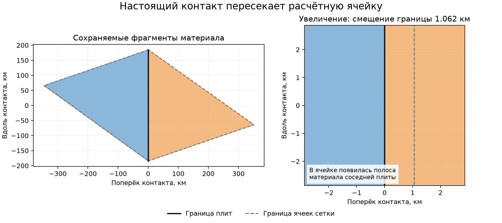

# Геометрия контактов внутри смешанных ячеек

30.09.2026. Рабочая копия `D:\Moon Project\mantle-convection`, ветка
`fix/genesis-mantle-convection`. Продолжение
[плана геометрии контактов](analysis/fractional_time_validation/CONTACT_GEOMETRY_NEXT.md).

Следующий реализованный этап: [локальная полярность и связь со слэбовым архивом](GEOMETRIC_SLAB_CONNECTION_IMPLEMENTATION.md).

## Что реализовано

Каждая материальная порция теперь может хранить свой настоящий выпуклый
сферический многоугольник, идентификатор фрагмента, родительский фрагмент
и исходную материальную историю. Несвязные и невыпуклые области представлены
несколькими выпуклыми частями. При вращении плиты перемещаются вершины,
а не усреднённая доля заполнения расчётной ячейки.

Сохранённая геометрия не зависит от сетки интегрирования. Пересечение с
треугольниками сетки создаёт производное представление смешанных ячеек;
оно не подменяет исходные границы и не создаёт искусственные траншеи
на рёбрах расчётной сетки. При разделении одной порции все четыре обширные
величины делятся по одной мере площади: площадь, объём коры, холодный
объём мантии и избыточная масса. Возраст и поля повреждения не усредняются.

Контакт существует только на общей дуге двух действительно соседних
многоугольников разных плит. Он содержит обе материальные стороны,
концы дуги, длину, ориентированную нормаль, относительную нормальную
и касательную скорости, точные интегралы потока и плеча момента вдоль дуги.
Положительная нормальная скорость означает расхождение. Общий поворот
сохраняет идентификаторы контактов; разбиение дуги сохраняет её суммарные
интегралы.

Состояния с несколькими порциями на ячейку, которые хранили только площади,
нельзя однозначно превратить в такие многоугольники. Новый импорт начинает
с чистых исходных треугольников, после чего геометрия сохраняется в собственном
checkpoint с проверкой целостности.

## Геометрическая транзакция

Отдельный эксперимент с заданными скоростями находит фактические пересечения
после движения. Объявленная модель полярности снимает материал с большей
избыточной массой на единицу площади; возраст разрешает равенство этого
показателя. Сравнение учитывает относительную погрешность до 64 машинных
эпсилонов: последний разряд результата `масса / площадь` не выбирает сторону.
Равенство обоих свойств оставляет полярность неразрешённой:
возвращаются сами области пересечения, шаг не принимается. Сортировка
идентификаторов не выбирает погружающуюся сторону.

Порядок обработки следует направленным связям «принимающий → снимаемый»
в действительных пересечениях. Если сравнения с учётом округления образуют
цикл, он также объявляется неразрешённым. Предварительная проверка намеренно
консервативна: равное перекрытие двух исходных кандидатов останавливает шаг
даже тогда, когда третья плита могла бы полностью закрыть эту область.

Архив потерь хранит удалённый многоугольник, четыре материальных запаса,
донора, конкретный принимающий фрагмент и время события. Связь с контактом
устанавливается только при наличии общей дуги с оставшейся частью донора.
При отсутствии такой дуги запись остаётся `unresolved_attachment`.
`geometric_contact` подтверждает только соседство; это ещё не присоединённый
механический слэб.

Новая горячая кора появляется только в вычисленных незаполненных областях.
Для этого эксперимента владелец рождения задан явно: это владелец исходного
материального многоугольника, ушедшего из данной области. Такое правило
независимо от ячеек отображения, но пока не является моделью оси хребта.

Это отдельная схема геометрии конца шага (`endpoint_geometry_v1`): возраста
продвигаются, тепловые свойства и повреждения заморожены, рождения имеют
нулевой возраст в конце шага. Исправленная тепловая квадратура `gauss2_v2`
из предыдущего этапа сохранена в прежнем связанном эксперименте. Соединение
геометрических событий с её временами требует следующего изменения.

## Проверки

Общий контрольный поворот сохранённого Starter на 0,25 млн лет дал
**220 смешанных ячеек**. Сохранились все **122 физических контакта** и их
суммарная длина **48 486,4697 км**. Исходные 5120 материальных фрагментов
дали 25 872 части при проекции на сетку из 5120 ячеек. Максимальная
относительная ошибка заполнения ячейки — **8,66×10⁻¹⁵**, бюджета отдельной
материальной истории — **2,17×10⁻¹⁶**. Рождений и потерь нет; продолжение
из сохранения совпало побитово. Полная проверка заняла около 310 с.

Отчёт: [Starter, общий поворот](analysis/geometric_contact_validation/starter_common_sub4_v2/report.json).
Это контроль геометрии при нулевой относительной скорости плит.

Аналогичная [проверка состояния на 50 млн лет](analysis/geometric_contact_validation/saved50_common_sub4/report.json)
дала **443 смешанные ячейки**, сохранив все **245 контактов** общей длиной
**97 488,3987 км**. Максимальная ошибка бюджета отдельной истории по четырём
величинам — **2,22×10⁻¹⁶**, заполнения ячейки — **8,66×10⁻¹⁵**. В том числе
сохранены 11,6616 млрд км³ холодной мантии и 7,8226×10²⁰ кг избыточной массы.
Рождений и потерь нет, перезапуск точный; время проверки — 262,46 с.

Общая [сводка проверок и контрольных сумм](analysis/geometric_contact_validation/validation_summary.json)
связывает результаты с версией кода и исходными файлами.

Дополнительная [проверка поворота координат](analysis/geometric_contact_validation/static_contact_probe_final.json)
на обоих источниках сохранила ID всех 122 / 245 контактов. Максимальное
отклонение повёрнутой нормали — 1,74×10⁻¹⁵, относительное отклонение длины —
2,04×10⁻¹⁵. Длины также совпали с независимым подсчётом исходных рёбер между плитами.



На увеличении справа показана полоса материала соседней плиты шириной
около 1,06 км, вошедшая в старую расчётную ячейку при контрольном повороте.
Чёрная линия — физический контакт, пунктир — граница сетки.

Итоговый набор: **220 тестов прошли** за 106,79 с, включая 120 тестов
новой геометрии, контактов и запуска и 100 проверок прежнего дробного
переноса, материального учёта, тепловых событий и времени охлаждения.
Лог: [final_tests.log](analysis/geometric_contact_validation/final_tests.log).

Сверка с контрольными суммами, снятыми перед работой, подтвердила неизменность
**176 прежних файлов кода/конфигурации и 54 файлов исходных состояний**.
Исходные незакоммиченные изменения рабочей копии сохранены.

Проверены общий поворот и полный оборот, смена сетки интегрирования,
две разные границы при одинаковых долях площади, сумма интегралов при
разделении контакта, реальные принимающие соседи в трёхплитной задаче,
перестановка владельцев, арифметически равные свойства и отказ до рождения
материала при неразрешённой полярности. Четыре последовательных шага
раздельного движения сохраняют бюджеты по каждой материальной истории;
продолжение после второго шага побитово воспроизводит оставшиеся два.

Минимальная площадь фрагмента не задаётся. Проверки определителей учитывают
округление координат и отдельно считают неоднозначные попадания на границу.
Если вновь вычисленная точка пересечения отличается от существующей вершины
не более чем на четыре машинных эпсилона единичного вектора, сохраняется
исходная вершина. Число замен и максимальное смещение записываются в
диагностику. Это предел разрешения координат binary64; сохранение и чтение
исходных вершин не меняют их биты.

Проверка с исходными скоростями на шаге 0,25 млн лет завершилась явной
неразрешённой полярностью:

| Источник | Парные перекрытия с равными свойствами | Сумма площадей этих пересечений, км² |
| --- | ---: | ---: |
| Starter | 162 | 22,7736 |
| Состояние на 50 млн лет после Starter | 334 | 15 979,5683 |

Это площади кандидатных парных пересечений, а не принятая площадь
погружения; тройные перекрытия могут входить в несколько пар. Ни один
неопределённый шаг не опубликован как готовое состояние. Исходники расчёта
и исходный код эксперимента не менялись во время этих прогонов. Отчёты:
[Starter](analysis/geometric_contact_validation/starter_actual_motion_final/report.json),
[50 млн лет](analysis/geometric_contact_validation/saved50_actual_motion_final/report.json).

## Файлы

- [spherical_polygons.py](tectonics/spherical_polygons.py): сферические примитивы.
- [geometric_surface.py](tectonics/geometric_surface.py): сохраняемые фрагменты,
  проекция на сетку, материальное разделение и checkpoint.
- [geometric_contacts.py](tectonics/geometric_contacts.py): реальные дуги,
  кинематика и интегралы.
- [geometric_transport.py](tectonics/geometric_transport.py): перекрытия,
  геометрические зазоры и пассивный архив потерь.
- [run_geometric_contact_probe.py](run_geometric_contact_probe.py): отдельный запуск.

Запуск из рабочей копии (каталог результата должен быть новым):

```powershell
.\.venv\Scripts\python.exe run_geometric_contact_probe.py --out analysis\my_contact_geometry --dt-myr 0.25 --steps 1 --common-omega 0.002 -0.003 0.001
```

Этот общий поворот служит контролем геометрии: относительное движение плит
равно нулю. Без `--common-omega` используются скорости исходного checkpoint;
при равных свойствах перекрывающихся плит отчёт получает статус
`unresolved_polarity`, а не искусственно выбранную сторону погружения.
Для продолжения используются `--resume` и прежние параметры эксперимента.

## Границы этапа

Скорость плит этим изменением не подгоняется и не пересчитывается. Основной
GUI, механика 0.5 и связанный эксперимент с базальными силами остаются
прежними. Геометрия подготавливает необходимые входы для сил хребтов и
тяги погружающегося материала.

Следующий переход требует разрешения полярности молодых одинаковых плит,
преемственности механических контактов при их разделении/слиянии,
присоединения архива к слэбам и согласования времени геометрических событий
с охлаждением. Затем можно подключать моменты сил и оценивать изменение
скоростей в связанном расчёте.
