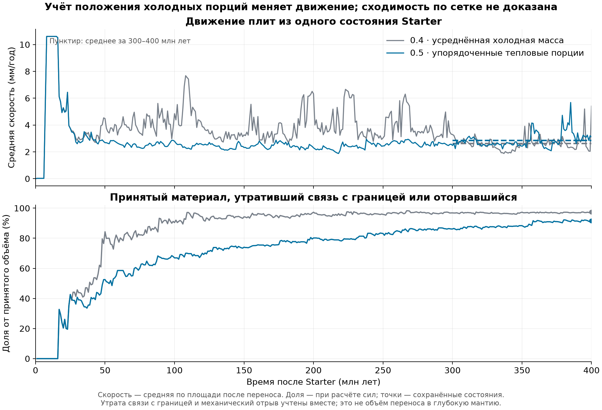

# Продолжение исправлений: геометрия тепловой тяги, версия 0.5

Новейший этап: [связанный эксперимент с дробным материалом и базальными силами](FRACTIONAL_COUPLING_IMPLEMENTATION.md).
Он пока не заменяет полную механику 0.5, описанную ниже.

Следующий отдельный этап: [дробный перенос материала](FRACTIONAL_TRANSPORT_IMPLEMENTATION.md).
Он проверяется при заданных скоростях и пока не включён в связанный расчёт 0.5.

Рабочая копия — `D:\Moon Project\mantle-convection`, ветка
`fix/genesis-mantle-convection`. Изменения предыдущих этапов сохранены,
коммитов нет. Предыдущий результат и его ограничения описаны в
[отчёте 0.4](SLAB_SINKING_IMPLEMENTATION.md).

## Что исправлено

Сила тяжести теперь вычисляется отдельно для каждой сохранённой порции
погружённого материала. Порции располагаются вдоль плиты по времени принятия:
свежая у траншеи, старая глубже. Для каждой используется её собственная
сохранившаяся холодная масса и интеграл наклона на занимаемом участке.
Раньше суммарная холодная масса равномерно распределялась по всей длине,
включая прогретые старые части. Это могло помещать свежую отрицательную
плавучесть слишком глубоко и завышать её тягу.

Сопротивление изгибу и мантии по-прежнему считается один раз на связанный
участок. Расчёт силы не создаёт вещество, не меняет его возраст и не меняет
тепловые резервуары Genesis. При однородной плотности вдоль плиты новый
интеграл воспроизводит прежнее решение. Разбиение одного слоя на несколько
равнозначных частей не меняет силу.

Исправлен также перенос за нижнюю границу учёта. Самые старые порции уходят
первыми, а одновременно принятые части — пропорционально. Прежний обход
словаря мог выбирать, какую из одновременно поступивших тёплых/холодных
порций удалить первой. Теперь результат не зависит от порядка этих записей.
Общий принятый объём сохраняется в прикреплённом, отсоединённом и глубинном
регистрах.

Журнал обрывов дополнен составом нагрузки: тяжесть, сопротивление изгибу,
сопротивление мантии, реакция запрета обратной подачи, сечение и прочность.
Это позволяет проверять причину каждого события, а не только видеть
отношение итоговой нагрузки к порогу.

Новые продолжения от Starter используют `young-mechanics-0.5` и
`ordered_thermal_cohorts_v1`. Сохранения 0.4 без нового поля продолжают
`uniform_thermal_mass_v1`; их механический закон не меняется. Геометрическая
модель хранится и в конфигурации, и в материальном регистре, а несоответствие
при загрузке отклоняется. Смена закона требует новой независимой серии из
Starter. Прежние режимы 0.3 и 0.2 также сохранены.

## Что выяснено о частых обрывах

Прежняя скалярная прочность Starter, около 4–5 МПа, описывает эффективный
поверхностный разрыв. Применение этого порога ко всему сечению погружённой
плиты остаётся грубым приближением. Достигнуть предела текучести на глубине
не означает мгновенно перерезать всё сечение.
Различие между хрупким разрывом и вязким утонением подробно разобрано в
[Duretz, Schmalholz и Gerya, 2012](https://agupubs.onlinelibrary.wiley.com/doi/full/10.1029/2011GC004024).
Это основание для выбора следующего механизма, а не подтверждение его
параметров для данного спутника.

На замороженных состояниях 0.4 проверены нагрузки перед дополнительными
обрывами. В этих пробах некоторые участки испытывают от одной только тяжести
осевое напряжение 24–40 МПа против порога около 4 МПа; для тонких участков
получено более 100 МПа. Реакция запрета обратной подачи иногда усиливает
нагрузку, но все 12 обнаруженных в этих пробах событий превышают скалярный
порог и без собственной добавки реакции при той же скорости. Это не разбор
всех 1023 исторических событий: прежний журнал не сохранял их состав сил.

Диагностика давления использует существующие плотность, гравитацию и
коэффициенты трения. Она показывает, почему прочность всего сечения нельзя
отождествлять с поверхностными 4 МПа. Эта оценка не включена как новый порог
обрыва: она не рассчитывает пластическую деформацию или утонение шейки.
При явно заданном нулевом поровом давлении и интегрировании по глубине
получены средние пределы 47–127 МПа; девять из двенадцати замороженных
примеров лежат ниже такой иллюстративной границы. Однако использование
существующей ньютоновской вязкости Starter для равномерного растяжения
даёт для них крайне большие времена единичной деформации. Эти времена
не являются временами обрыва. Перенос закона Starter в шейку без проверки
реологии и геометрии не обоснован.
[Расчёт и предположения](analysis/slab_sinking_followup/physics_strength_probe.json).

Независимый разбор первых 50 млн лет выявил численную причину скачков:
**все шаги с обрывами следовали за принятием новой порции на предыдущем
шаге** — 15/15 при шаге 1 млн лет, 39/39 при шаге 0,5 млн лет и 16/16
на уточнённой сетке. Расхождение скоростей между сетками возникает ещё до
первого обрыва. Типичная принимаемая порция уменьшается примерно с
65 тыс. до 16 тыс. км², а её мгновенная длина вдоль плиты — со 177 до 88 км.
Так изменяется и доля участка, попадающая в изгиб. Подробности — в
[разборе переноса](analysis/slab_sinking_followup/validation_baseline.md).

## Что осталось незавершённым

Мгновенный обрыв по скалярной прочности пока сохранён и явно указан в
описании модели. Его согласованная замена требует отдельной скорости
погружённого тела, растяжения соединяющего участка и изменения толщины
при сохранении объёма. Нужно переносить границу между шейкой и телом по
реальным порциям материала и использовать деформированную геометрию в
силах и глубинном переносе. Добавление только задержки или повышенного
порога оставило бы эти связи незамкнутыми.

Перенос поверхности всё ещё растровый. Новый порядок тепловых порций
использует время принятия целой ячейки, поэтому не устраняет дискретность
начала погружения. Следующий этап исходного плана — консервативный перенос
долей ячеек вместе с возрастом, тепловой и механической памятью; после него
можно согласованно включать деформируемую шейку.

Сохраняются заданная форма и наклон плиты, упрощённое течение мантии,
тепловая плавучесть без химической плавучести коры и раздельный глобальный
тепловой баланс. Новые коэффициенты сил для получения желаемой скорости
не вводились.

## Проверка

Две версии сравнены из одного исходного Starter, при прежней нагрузке мантии
0,08 МПа и неизменных коэффициентах сопротивления. Основная сетка — subdivision
4, шаг — 1 млн лет. Средняя скорость взвешена по площади поверхности.

| После Starter, млн лет | Средняя 0.4, мм/год | Средняя 0.5, мм/год | Максимальная 0.5, мм/год |
|---:|---:|---:|---:|
| 50 | 4,483 | 2,684 | 3,905 |
| 100 | 4,848 | 2,794 | 4,511 |
| 200 | 6,327 | 2,302 | 3,942 |
| 400 | 5,410 | **3,114** | **5,795** |

Эти значения — моментальные срезы. Средняя по времени на интервале
300–400 млн лет изменилась с **2,640 до 2,864 мм/год** (+8,51%); медиана —
с 2,568 до 2,706 мм/год. Поэтому один конечный срез даёт неполную картину.
Первое различие сил появляется на 18 млн лет, а первое различие числа
обрывов — на 26 млн лет. Небольшая разница сил меняет последовательность
дискретных переносов и обрывов и со временем приводит к другой истории.

На 400 млн лет зарегистрировано 452 механических обрыва против прежних
1023. Принятый океанический объём — 67,342 млн км³; из него 4,788 млн км³
сохраняет связь с плитами, 0,801 млн км³ перешло за глубинную границу,
61,753 млн км³ отсоединено либо потеряло подтверждённую геометрическую связь.
Доля последнего регистра уменьшилась с 97,37% до 91,70%, но всё ещё велика.
Эту долю нельзя целиком приписывать разрушению по прочности.
Именно механическими обрывами отсоединено 53,208 млн км³, или **79,01%**
принятого объёма; в версии 0.4 было **90,86%**. Ещё 8,544 млн км³
приходится на утрату подтверждённой геометрической связи.

Новый журнал позволяет разобрать все 452 события: в 420 случаях одна
только тяжесть превышала текущую скалярную несущую способность; в 142
событиях присутствовала существенная реакция запрета обратной подачи.
Эти группы пересекаются. Вычитание одного слагаемого при неизменной
скорости не заменяет повторного решения равновесия, но показывает,
почему нужно пересмотреть и модель прочности, и связь движения тела
с подачей у поверхности.
[Состав нагрузок](analysis/slab_sinking_followup/validation_failure_decomposition.json).

Последний баланс механической мощности: источники 1,333753 ГВт,
базальная диссипация 0,414963 ГВт, изгиб 0,765292 ГВт, сопротивление мантии
0,153498 ГВт. Работа тяжести погружённого материала — 0,109050 ГВт.
Все семь проверок состояния прошли. Проверены **603 шага в 10 завершённых
участках**, максимальные относительные невязки моментов и мощности —
3,88×10⁻¹⁶ и 4,76×10⁻¹⁵ соответственно.
[Результаты](analysis/slab_sinking_followup/validation_results.json),
[проверка шагов](analysis/slab_sinking_followup/validation_step_audit.json).

**Сходимость не установлена.** На 50 млн лет шаг 0,5 млн лет даёт
3,349 мм/год (+24,77% к основной серии), subdivision 5 при шаге 1 млн лет —
3,498 мм/год (+30,32%). Исправление распределения тяги не решает дискретность
переноса поверхности. Эти числа по-прежнему нельзя считать точным прогнозом
движения плит реального спутника.

Целевая серия после последнего исправления решателя завершена: **199 тестов прошли**. Проверены интеграл силы,
неотрицательная диссипация и баланс мощности, перестановка/разбиение порций,
сохранение материала, старые режимы, запуск через CLI, продолжение и смена
сетки. [Журнал](analysis/slab_sinking_followup/final_focused_tests.log).

Уточнённая сетка выявила ошибку численного определения действующих реакций:
SLSQP оставлял у нулевых сил шум около 10⁻¹¹, а прежнее однократное выделение
ненулевых сил принимало его за физический результат. Теперь точные шаги
минимизации доходят до ограничивающей нулевой силы и при необходимости
возвращают переменную в решение. Исходные проверки равновесия, знака и
условий оптимальности сохранены. Реальный случай добавлен в регрессионные
тесты; независимый алгоритм подтвердил результат на 240 вариантах дробления
участков. [Независимая проверка](analysis/slab_sinking_followup/numerical_secondary_sub5.json).

Повтор первых 50 млн лет итоговым решателем воспроизвёл исходную серию 0.5
побитно, включая физические массивы и историю. Поэтому продолжение от
проверенного сохранения 200 млн лет не меняет поставленную физическую задачу.
[Повтор](analysis/slab_sinking_followup/validation_solver_recheck.json).

Физический вывод, первичные источники и отдельная диагностика прочности —
в [PHYSICS_FOLLOWUP.md](analysis/slab_sinking_followup/PHYSICS_FOLLOWUP.md).
Четыре аналитические проверки диагностического расчёта также прошли;
он не участвует в производственном расчёте сил.

Неподвижная проба на прежнем состоянии 400 млн лет, до повторной проверки
обрывов и с одинаковым набором всех присоединённых участков,
показывает: в девяти участках с разновозрастными порциями тяга уменьшается
примерно на 14–49%, но они уже сильно прогреты, поэтому суммарная тяга
меняется лишь на −0,001%. Это исправление физической неточности, а не
подтверждение устранения основной причины низкой скорости.

При повторном решении равновесия на прежних состояниях 50/100/400 млн лет
скорости меняются с 4,416/4,572/5,493773 до 4,384/4,538/5,493761 мм/год.
Это неподвижные контрфактические пробы; они не заменяют новую эволюционную
серию и могут отсоединять другой набор участков при проверке прочности.

Продолжение 0.5 с одним и четырьмя процессами воспроизвело физическое
состояние и метаданные побитно. Реальное сохранение 0.4 при продолжении
50→51 млн лет сохранило прежние массивы и физическую историю; единственное
дополнение метаданных — новые диагностические поля в одной записи обрыва.
[Совместимость](analysis/slab_sinking_followup/validation_compatibility.json),
[сравнение процессов](analysis/slab_sinking_followup/validation_cpu_parity.json).

## Готовые результаты и запуск

Итоговые контрольные суммы и проверки — в
[validation.json](analysis/slab_sinking_followup/validation.json),
команды воспроизведения — в [README](analysis/slab_sinking_followup/README.md).
Исходный Starter сохранён, его SHA256:
`b4584dd66208ff80aea18a178c38da2b96e353c723663251091886dee49e87f6`.

Основная серия 0–200 млн лет находится в
`analysis/slab_sinking_followup/runs/ordered_sub4_dt1`; продолжение после
численного ремонта решателя — в `ordered_sub4_dt1_solver_fixed` рядом с ней.
[Готовое сохранение 400 млн лет](analysis/slab_sinking_followup/runs/ordered_sub4_dt1_solver_fixed/elapsed_0400)
можно передать в `--resume`. Например, `--duration-myr 450` продолжит
его до 450 млн лет после исходного разделения. Выходной каталог должен
быть новым и, для GUI, находиться внутри `results` этой рабочей копии.

Источники и воспроизводимые пробы расположены в
`analysis/slab_sinking_followup`. Для запуска используется `.venv` этой
рабочей копии и прежний `run_genesis_starter_continuation.py`.
