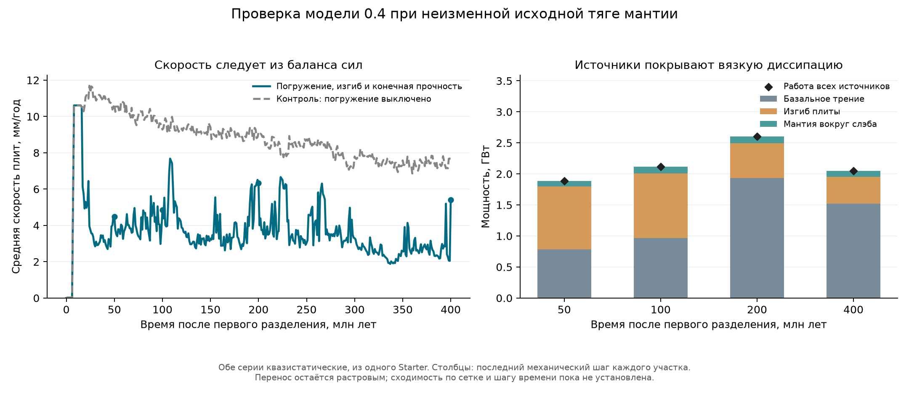

# Погружение плит: версия механики 0.4

Последующее исправление распределения тяги и порядка глубинного переноса —
[версия 0.5](SLAB_COHORT_GEOMETRY_IMPLEMENTATION.md). Новые продолжения
по умолчанию используют её; ниже сохранены результаты и описание 0.4.

Рабочая копия: `D:\Moon Project\mantle-convection`, ветка
`fix/genesis-mantle-convection`. Предыдущие изменения сохранены, коммитов нет.
Этот этап продолжает [исходный план](SLOW_PLATE_MOTION_PLAN.md) и
[реализацию 0.3](YOUNG_MECHANICS_IMPLEMENTATION.md).

## Реализованный механизм

В новом режиме `young-mechanics-0.4` принятый погружённый материал участвует
в общем квазистатическом балансе моментов всех плит. Сила тяжести, сопротивление
изгибу и вязкое сопротивление мантии рассчитываются в SI. Передача нагрузки
между погружающейся и перекрывающей плитами следует из одной кинематической
схемы: траншея движется с перекрывающей плитой, подача материала равна
относительной нормальной скорости. Свободное отступание траншеи пока не решено.

Вместо передачи полного веса как горизонтальной силы используется работа
тяжести при фактическом наклоне принятого участка. У молодого короткого участка
наклон развивается вдоль плавного изгиба. Тяга и оба сопротивления непрерывно
исчезают при исчезновении принятого материала. Прогрев уменьшает тепловую
отрицательную плавучесть, но не удаляет объём и сопротивление оставшегося тела.

Сопротивления собраны как положительные формы диссипации. Поэтому движение
обеих плит решается совместно, а сопротивление не вычитается по скорости
предыдущего шага. Вязкость окружающей мантии берётся из текущего состояния
Genesis, по прежнему закону Аррениуса. Предписанная поверхностная мантийная
нагрузка остаётся **0,08 МПа**, базальное сопротивление не менялось.

Новая версия использует непосредственно квазистатическое решение. Старая
45-миллионолетняя фильтрация скорости не имеет в этой задаче собственного
инерционного или упругого накопителя энергии; она сохраняется только в
прежних версиях. Сравнение с выключенным погружением проводится отдельно
в том же новом режиме, чтобы не приписывать этот эффект тяге погружения.

## Связь материала с границей и разрушение шейки

Связь погружённого материала с траншеей переносится между соседними рёбрами
той же пары плит. Удалённая граница той же пары не считается доказательством
связи. Потерявший связь материал остаётся в отдельном учёте, но больше не тянет
поверхностную плиту. Объём не списывается второй раз.

Первый линейный опыт выявил участки с обратной подачей: он пытался вернуть
вещество через траншею, хотя поверхностный перенос этого ещё не поддерживает.
Поэтому для присоединённого участка явно выбрана необратимая ветвь
`q >= 0`. Реакция остановленного участка включена в баланс, её работа при
нулевой подаче равна нулю. Это ограничение само по себе могло бы удерживать
границу с неограниченной силой, поэтому дополнительно проверяется прочность
шейки: **полное передаваемое растяжение ≤ текущая прочность × сечение**.

Прочность берётся из живой памяти разрушения Starter, уже учитывающей его
температурное ослабление, воду и повреждение. Новый порог прочности не вводится.
Перегруженная шейка отсоединяется, её вещество остаётся в балансе, а силы
пересчитываются. Причина, время, нагрузка, прочность и объём отсоединения
сохраняются. Это модель хрупкого предела прочности, а не расчёт постепенного
утонения шейки или обратного выноса вещества на поверхность.

## Явные приближения

Три новых материальных/геометрических предположения сохранены в конфигурации:

| Параметр | Значение по умолчанию | Смысл |
|---|---:|---|
| `young_slab_viscosity_contrast` | 100 | Эффективная вязкость изгиба относительно мантии |
| `young_slab_bend_radius_thickness_ratio` | 3 | Радиус кривизны относительно холодной толщины |
| `young_slab_mantle_shear_length_fraction` | 0,5 | Масштаб вязкого сдвига относительно физической глубины мантии |

Эти параметры задают приближённую геометрию и реологию; они не измерены для
этого спутника и не подбирались для получения земной скорости. Проверка
чувствительности обязательна. Вывод уравнений и первичные научные источники —
в [PHYSICS_DESIGN.md](analysis/slab_sinking_validation/PHYSICS_DESIGN.md).

Остаются ограничения исходного плана: растровый перенос вместо переноса долей
ячеек; заданная форма погружённой плиты и упрощённое течение вокруг неё;
тепловая плавучесть мантии без химической плавучести коры; отсутствие полного
решения напряжений и их переноса в живом damage. Модель погружения не добавляет
второй источник или сток глобальной энергии Genesis. Баланс механической
мощности и сохранение тепла проверяются раздельно; обратная передача вязкого
нагрева в глобальный тепловой резервуар здесь не решается.

## Результат расчёта

Две серии выполнены из одного исходного Starter до **400 млн лет после
первого разделения**, с шагом 1 млн лет и сеткой subdivision 4 (5120 ячеек).
Контроль использует ту же квазистатическую механику 0.4, но без сил и
сопротивлений погружения. Средняя скорость взвешена по площади поверхности;
значения ниже относятся к сохранённым моментам времени, а не к установившейся
скорости всей истории.

| Время после разделения, млн лет | Погружение: средняя, мм/год | Погружение: максимум, мм/год | Контроль: средняя, мм/год |
|---:|---:|---:|---:|
| 50 | 4,483 | 6,716 | 10,683 |
| 100 | 4,848 | 8,999 | 9,278 |
| 200 | 6,327 | 14,567 | 9,123 |
| 400 | **5,410** | **12,767** | **7,678** |

Средняя по времени за последние 100 млн лет — **2,640 мм/год**, медиана —
2,568 мм/год. Повышенное значение в самой конечной точке связано с 17
отсоединениями на последнем шаге: между 399 и 400 млн лет скорость меняется
с 2,045 до 5,410 мм/год, а сопротивление изгибу снижается. Это физический
отклик выбранного дискретного закона, а не установившееся ускорение.
[Последние шаги](analysis/slab_sinking_validation/final_steps.json),
[статистика последнего интервала](analysis/slab_sinking_validation/last100_myr_statistics.json).

В этом опыте сопротивления погружению перевесили добавленную тягу. Результат
не подтверждает ожидание, что включение slab pull обязательно ускорит плиты.
Предыдущие 8,875/15,185 мм/год относятся к версии 0.3 с задержкой отклика;
их нельзя использовать для выделения эффекта одного нового механизма.



На последнем механическом шаге работа всех источников составляет 2,046775 ГВт,
из неё работа тяжести погружённого материала — 0,030195 ГВт. Диссипация:
базальное сопротивление 1,522916 ГВт, изгиб 0,434127 ГВт, окружающая мантия
0,089732 ГВт. Относительная невязка мощности — около 9×10⁻¹⁶. Тепловая
эволюция Genesis совпадает с контролем; это ожидаемо при пока раздельных
механическом и глобальном тепловом балансах.

**Устойчивая землеподобная субдукция пока не подтверждена.** К 400 млн лет
принято 115,615 млн км³ океанического материала, из них только 3,037 млн км³
сохраняют связь с поверхностными плитами. Остальные 97,37% учтены как
отсоединённые либо не получившие подтверждённой локальной связи; это не
потеря вещества и не доказательство, что весь этот объём оборвался по
прочности. Разбор журнала показывает: **90,86% принятого объёма отсоединено
по пределу прочности**, ещё 6,51% потеряло геометрическую связь. Журнал
содержит 1023 события разрушения шейки в 255 разных моментах времени, без
повторного учёта одного события; за один шаг возможны несколько разрывов.
До глубинной границы материал в этой серии не дошёл. Это режим частых
образований и обрывов связи с преимущественно базальным движением и слабой,
непостоянной тягой погружения. История скорости неровная и чувствительна к
дискретным событиям переноса/отсоединения.
[Разбор материального учёта](analysis/slab_sinking_validation/final_inventory_interpretation.json).

## Проверки и предел точности

- Финальная целевая серия: **157 тестов прошли** — механика, ограничения,
  сохранение материала, совместимость, продолжение и смена сетки.
  После отдельного исправления текста отчёта повторены все 16 тестов
  совместимости, включая новую проверку описания режима; они также прошли.
  Эти группы пересекаются, их количества не суммируются.
- Расширенная серия: 2205 прошли, 5 первоначальных отказов. Три отказа
  относились к устаревшей тестовой конфигурации после смены версии по
  умолчанию; она исправлена, все 18 соответствующих проверок прошли и вошли
  в финальную серию. Два прежних отказа GUI остаются: проверка каталога вывода
  `test_checkpoint_introspection_and_spec_validation` и
  `test_resume_cannot_change_checkpoint_resolution`. Полностью зелёного
  результата всей расширенной серии не заявляется.
- На каждом записанном шаге завершённых серий проверены баланс моментов и
  мощности, положительность сопротивлений, допустимая подача и конечная
  растягивающая нагрузка. Все семь проверок сохранённого состояния проходят:
  материал, часы, повреждение, тепло, вода, положительные остатки и учёт
  погружённого вещества. [Протокол](analysis/slab_sinking_validation/step_audit.json).
  Итог аудита — 1053 шага в 15 завершённых участках, все проверки прошли;
  максимальные относительные невязки моментов/мощности — 1,18×10⁻¹⁵/4,76×10⁻¹⁵.
- Продолжение населённого состояния 50→51 млн лет с одним и четырьмя
  процессами дало побитно одинаковое физическое состояние. Проверены также
  продолжение со сменой сетки и реальное старое сохранение 0.3 на 400→401 млн
  лет. [Сравнение процессов](analysis/slab_sinking_validation/cpu_parity.json).
- Два вырожденных случая решателя из длинного прогона сохранены как
  регрессионные примеры. Исправлены ложные огромные взаимно компенсирующиеся
  реакции и потеря точности при распределении реакций; физическая задача и
  её допуски не ослаблялись. Независимый повтор первых 50 млн лет с итоговым
  решателем воспроизвёл все массивы состояния побитно; меняются лишь последние
  разряды 30 диагностических записей нагрузки, не более 1,69×10⁻¹³ относительно.
  [Повтор](analysis/slab_sinking_validation/solver_final_recheck.json).

**Сходимость по сетке и времени не установлена.** На 50 млн лет уменьшение
шага с 1 до 0,5 млн лет меняет среднюю скорость с 4,483 до 3,887 мм/год
(−13,3%), а subdivision 5 при прежнем шаге — до 3,084 мм/год (−31,2%).
Меняются и история переносов, и отсоединения. Поэтому приведённые скорости
нельзя считать точным физическим прогнозом.

Замороженные пробы также показывают сильную зависимость от предположений:
при контрасте вязкости 10/100/1000 средняя мгновенная скорость равна примерно
8,725/4,417/0,885 мм/год; при радиусе изгиба 2/3/5 толщин —
2,031/4,417/7,984 мм/год. Это ответы на одном сохранённом состоянии, а не
долгосрочные эволюционные расчёты. Некоторые пробы меняют набор разрушенных
шеек, поэтому сравнивают также разную оставшуюся нагрузку.

Следующие незавершённые пункты исходного плана: консервативный перенос долей
ячеек, проверка сходимости событий погружения и разрушения, связь нагрузки
шейки с полноценным полем напряжений и повреждения. Рост физической полноты
этой версии сам по себе ещё не доказывает рост количественной точности.

## Воспроизводимость и запуск

Компактные результаты — [comparison.json](analysis/slab_sinking_validation/comparison.json),
данные графика — [speed_and_power.json](analysis/slab_sinking_validation/speed_and_power.json).
Контрольные суммы кода, исходного архива и готовых сохранений собраны в
[validation.json](analysis/slab_sinking_validation/validation.json).
В сохранённых JSON раннего отчёта осталась устаревшая фраза 0.3 о выключенной
тяге. Генератор описания исправлен отдельно после расчётов; исходные отчёты
и контрольные точки не переписаны. Для них сохранена
[поправка к описанию](analysis/slab_sinking_validation/saved_report_limitations_correction.json)
с контрольными суммами. Фактически использованная модель указана в конфигурации
и следах сил, результаты в таблице соответствуют включённому погружению.
Основная серия 0–100 млн лет находится в
`analysis/slab_sinking_validation/runs/validated_sinking_sub4_dt1`,
продолжение 100–400 после ремонта решателя — в
`analysis/slab_sinking_validation/runs/validated_sinking_fixed2_sub4_dt1`.
Неудавшиеся попытки достичь 200 млн лет сохранены для разбора и не входят в
итоговую серию. Промежуточный опыт с обратной подачей также не считается
итоговым: [разбор](analysis/slab_sinking_validation/INTERIM_REVERSE_FEED_FINDING.md).

Исходный архив Starter не изменён, SHA256:
`b4584dd66208ff80aea18a178c38da2b96e353c723663251091886dee49e87f6`.

Новые продолжения от исходного Starter выбирают 0.4. Уже сохранённые 0.3
продолжают прежний закон; молчаливой миграции нет. Старый интерфейс запуска
сохранён. Для воспроизведения из этой рабочей копии:

```powershell
& .\.venv\Scripts\python.exe run_genesis_starter_continuation.py `
  --starter-checkpoint results/genesis_runs/starter_20260928_192306_547551/starter_checkpoint.npz `
  --output results/young_slab_sinking `
  --duration-myr 400 --step-myr 1 --surface-only-frames
```

Выходной каталог должен быть новым. Скрипты сравнений и чувствительности
находятся в [analysis/slab_sinking_validation](analysis/slab_sinking_validation/README.md).

Готовое сохранение 400 млн лет для дальнейшего продолжения:
[elapsed_0400](analysis/slab_sinking_validation/runs/validated_sinking_fixed2_sub4_dt1/elapsed_0400).
В CLI аргумент `--resume` принимает эту папку, а `--duration-myr` задаёт
итоговое время после исходного разделения, например 450 для продолжения
400→450 млн лет. Рабочая среда — `.venv` в этой рабочей копии.
